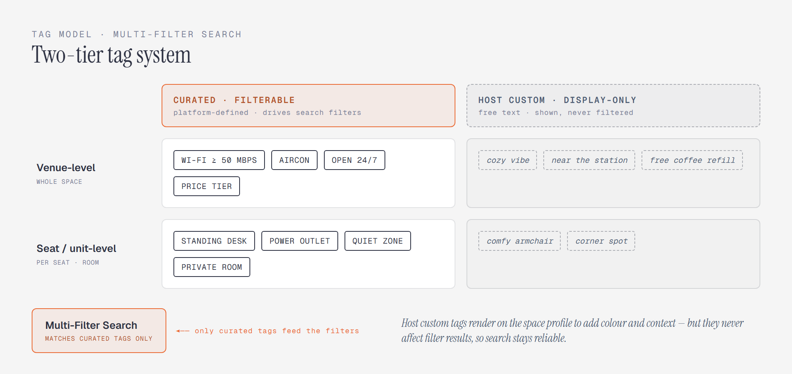
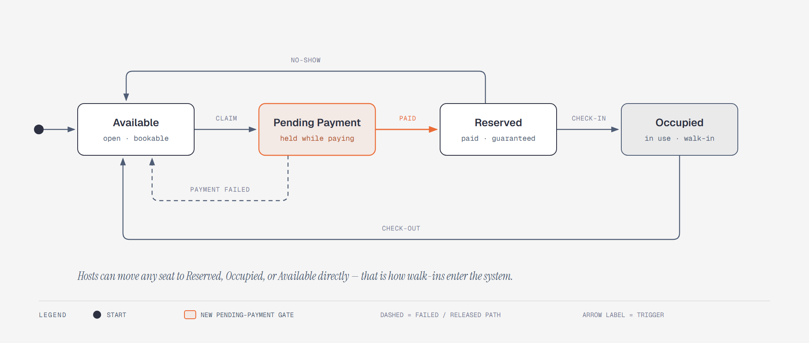
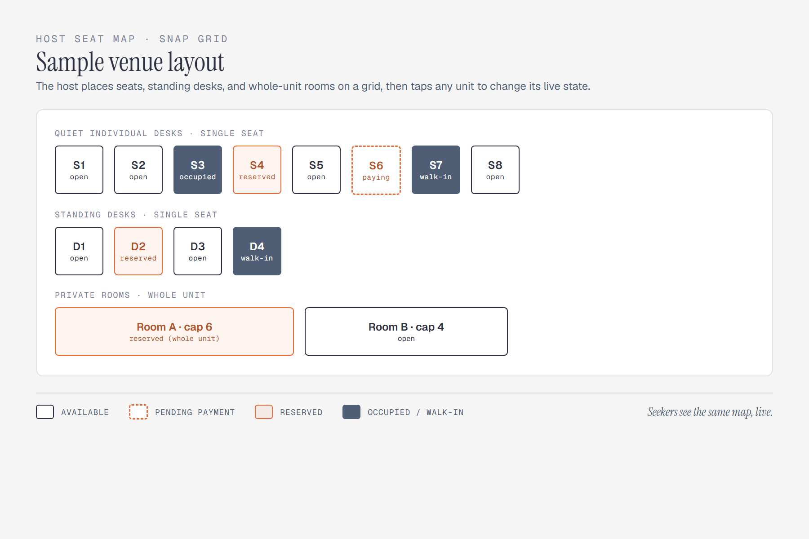

# StudyHub Web Application

Software Requirements Specification

Version 2.0

*Course: Software Development 1*

*Prepared by: Adrian Seth Tabotabo, Maria Faith Antigua, Luke Miguel Dongque, James Niño Mandawe*

# Revision History

| **Date** | **Version** | **Description** |
|----|----|----|
| 09/07/2026 | 1.0 | Initial Software Requirements Specification baseline for the StudyHub web application. |
| 09/14/2026 | 2.0 | Revised baseline after design review: reserve-now (current-state) model with exact-seat selection on a host-built snap-grid seat map; host-maintained live availability; sandbox reservation-fee payments with a Pending-Payment state; Supabase Auth + Row-Level Security; hybrid (curated + custom) tag model; realistic, testable non-functional requirements; added Reviews and Administration modules and a key-entity data model. |

*Author: Adrian Seth Tabotabo, Maria Faith Antigua, Luke Miguel Dongque, James Niño Mandawe*

# Table of Contents

- [1. Introduction](#1-introduction)
  - [1.1 Purpose](#11-purpose)
  - [1.2 Scope](#12-scope)
  - [1.3 Definitions, Acronyms, and Abbreviations](#13-definitions-acronyms-and-abbreviations)
  - [1.4 References](#14-references)
  - [1.5 Overview](#15-overview)
- [2. Overall Description](#2-overall-description)
  - [2.1 Product Perspective](#21-product-perspective)
  - [2.2 Product Functions](#22-product-functions)
  - [2.3 User Classes and Characteristics](#23-user-classes-and-characteristics)
  - [2.4 Operating Environment](#24-operating-environment)
  - [2.5 Design and Implementation Constraints](#25-design-and-implementation-constraints)
  - [2.6 Assumptions and Dependencies](#26-assumptions-and-dependencies)
- [3. Specific Requirements](#3-specific-requirements)
  - [3.1 Functionality](#31-functionality)
    - [3.1.1 Function 1 — Space Discovery & Multi-Filter Search](#311-function-1--space-discovery--multi-filter-search)
    - [3.1.2 Function 2 — Reserve-Now Seat Selection, Payment & Check-in](#312-function-2--reserve-now-seat-selection-payment--check-in)
    - [3.1.3 Function 3 — Host Seat-Map & Live Occupancy Management](#313-function-3--host-seat-map--live-occupancy-management)
    - [3.1.4 Function 4 — Community Reviews & Ratings](#314-function-4--community-reviews--ratings)
    - [3.1.5 Function 5 — Platform Administration](#315-function-5--platform-administration)
  - [3.2 Usability](#32-usability)
    - [3.2.1 Efficient Search-to-Hold Workflow](#321-efficient-search-to-hold-workflow)
    - [3.2.2 Accessibility & Responsive Layout](#322-accessibility--responsive-layout)
  - [3.3 Reliability & Availability](#33-reliability--availability)
  - [3.4 Performance](#34-performance)
  - [3.5 Security](#35-security)
    - [3.5.1 Authentication & Role-Based Access](#351-authentication--role-based-access)
    - [3.5.2 Data Protection & Vulnerability Mitigation](#352-data-protection--vulnerability-mitigation)
  - [3.6 Design Constraints](#36-design-constraints)
    - [3.6.1 Platform & Architecture](#361-platform--architecture)
    - [3.6.2 Economic & Infrastructure](#362-economic--infrastructure)
  - [3.7 Interfaces](#37-interfaces)
    - [3.7.1 User Interfaces](#371-user-interfaces)
    - [3.7.2 Hardware Interfaces](#372-hardware-interfaces)
    - [3.7.3 Software & External API Interfaces](#373-software--external-api-interfaces)
  - [3.8 Key Data Entities](#38-key-data-entities)

# 1. Introduction

This Software Requirements Specification (SRS) defines the functional and non-functional requirements for Version 2.0 of the StudyHub web application. StudyHub connects students, freelancers, and remote workers who need conducive study environments with the local co-working spaces and study cafes that provide them. It lets a Seeker see which seats are open right now, hold a specific seat for a short window backed by a small reservation fee, and travel to the venue with a guaranteed spot; and it gives Hosts a live seat map they control. This document is the authoritative baseline for system design, database schema, sprint planning, test-case authoring, and final verification in the Software Development 1 course.

## 1.1 Purpose

This specification provides a formal, unambiguous technical reference for the development team, academic evaluators, and stakeholders. It states the precise behaviours, capabilities, constraints, and quality attributes of StudyHub v2.0 so that every requirement can be designed, built, and tested against a shared definition.

## 1.2 Scope

StudyHub is a centralized, two-sided web application for discovering, evaluating, and reserving conducive study spaces in real time. Version 2.0 deliberately adopts a current-state ("reserve-now") model: users hold seats that are open now, rather than scheduling seats for future dates.

**In-scope capabilities for v2.0:**

- Multi-role authentication and profile management (Study Seeker, Space Host, Platform Administrator) using Supabase Auth with Row-Level Security.

- Geolocation-based discovery on an interactive map, with multi-criteria filtering driven by a curated tag set (Wi-Fi tier, power outlets, noise level, air-conditioning, operating hours, price tier, room type).

- Space profile pages with photos, amenity tags, pricing, and a live, host-updated availability view showing when the count was last updated.

- A host-built snap-grid seat map on which Seekers select an exact seat, standing desk, or whole-unit room.

- Reserve-now booking with a Pending-Payment hold, a sandbox reservation-fee payment, a seeker-set wait window, QR check-in, and automatic no-show release.

- Host dashboard for building the seat map and directly setting any unit to Available, Reserved, or Occupied (including walk-ins).

- Community reviews and amenity ratings restricted to users who have completed a check-in at the venue.

- Platform administration: venue/owner verification, review moderation, and oversight of sandbox payments and refunds.

**Explicitly excluded from v2.0:**

- Real-money payment settlement (live GCash/Maya/card capture). v2.0 uses a payment gateway in sandbox/test mode to demonstrate the guaranteed-hold flow; the venue’s usage fee is still settled on-site. Real-money processing (with merchant onboarding, KYC, refunds, and dispute handling) is deferred to a future release.

- Advance/future scheduling of seats for a later date or time — the model is current-state only.

- Physical IoT desk-occupancy sensors; availability is maintained by hosts, not hardware.

- In-app virtual study rooms or video conferencing.

## 1.3 Definitions, Acronyms, and Abbreviations

| **Term** | **Definition** |
|----|----|
| Reserve-now | The current-state reservation model: a Seeker may hold only a seat that is open at that moment, and no future/scheduled bookings are supported. |
| Hold / Wait window | The short, seeker-set grace period during which a paid Reserved seat is guaranteed while the Seeker travels to the venue. |
| Seat map (snap grid) | A grid-based floor layout built by the Host, on which each seat, standing desk, or whole-unit room is a distinct, selectable unit. |
| Unit | The atomic bookable object: an individual seat, or a whole unit/room with a capacity. |
| Seat state | One of Available, Pending Payment, Reserved, or Occupied. |
| Curated tag | A platform-defined tag that powers search filters (e.g., Wi-Fi tier, power outlet, noise level). |
| Custom tag | A free-text tag a Host adds for display on the profile; it never affects filtering. |
| Sandbox payment | A payment processed through a gateway’s test environment; no real money is moved. |
| Supabase Auth / RLS | Managed authentication service and Row-Level Security policies used to enforce role-based access. |
| RBAC | Role-Based Access Control across Seeker, Host, and Administrator roles. |
| QR check-in | Confirming arrival by presenting a booking QR code that the Host scans or enters. |
| SRS / MVP | Software Requirements Specification / Minimum Viable Product. |
| WCAG 2.1 AA | Web Content Accessibility Guidelines, conformance level AA. |
| FCP / LCP | First Contentful Paint / Largest Contentful Paint (page-load metrics). |

## 1.4 References

1\. IEEE Std 830-1998, IEEE Recommended Practice for Software Requirements Specifications.

2\. ISO/IEC/IEEE 29148:2018, Systems and software engineering — Requirements engineering.

3\. Study Hub & Workspace Habits Survey (preliminary user study, N = 16 respondents, August 2026).

4\. Next.js & React Documentation (Vercel Inc., 2026).

5\. Supabase Documentation — Auth, Row-Level Security, and PostgreSQL (2026).

6\. OpenStreetMap Foundation & Leaflet.js mapping library documentation.

7\. PayMongo / Stripe test-mode (sandbox) payment API documentation.

8\. W3C Web Content Accessibility Guidelines (WCAG) 2.1, Level AA.

## 1.5 Overview

Section 2 gives an overall description of StudyHub: its context, functions, user classes, operating environment, constraints, and assumptions. Section 3 states the specific functional requirements (organized into five modules, each with numbered, testable requirements) and the non-functional requirements governing usability, reliability, performance, security, design constraints, interfaces, and the data model.

# 2. Overall Description

## 2.1 Product Perspective

StudyHub is a new, self-contained, cloud-hosted responsive web application. It addresses the fragmentation and lack of live availability information that currently make study-space discovery unreliable. The frontend and backend run on Next.js/Node.js and communicate over RESTful JSON APIs with a managed PostgreSQL database (Supabase). Maps are rendered with Leaflet over OpenStreetMap tiles; authentication is handled by Supabase Auth; reservation-fee payments are processed through a payment gateway in sandbox mode.

## 2.2 Product Functions

- Discover spaces on a map and filter them by curated amenity tags.

- View a space profile with a live, host-updated seat map.

- Hold an exact open seat now, pay a sandbox reservation fee, and receive a QR code.

- Check in on arrival; release the seat on check-out, no-show, or at closing.

- Let Hosts build a seat map and control every unit’s live state, including walk-ins.

- Let checked-in visitors leave amenity reviews.

- Let Administrators verify venues and moderate content and sandbox payments.

## 2.3 User Classes and Characteristics

| **User class** | **Characteristics and needs** |
|----|----|
| Study Seeker (student, freelancer, researcher) | Primary end-user. Wants fast, friction-free discovery of nearby open seats with verified amenities, and a guaranteed seat before travelling. In the survey (N = 16, preliminary), 87.5% wanted an integrated map with pricing and amenities and 75% wanted to check live availability before leaving. |
| Space Host (cafe owner, co-working manager) | Lists a venue, builds the seat map, and keeps availability current by tapping units. Needs a lightweight tool that reduces repetitive chat inquiries (43.8% of surveyed users found messaging apps too slow). |
| Platform Administrator | Verifies venue/owner legitimacy, moderates reviews, and oversees sandbox payments/refunds and general platform health. |

## 2.4 Operating Environment

- Client: modern desktop, tablet, and smartphone web browsers (Chrome, Edge, Firefox, Safari).

- Server: Node.js runtime on Vercel serverless; managed PostgreSQL on Supabase.

- External services: Leaflet/OpenStreetMap tiles; Supabase Auth; payment gateway (sandbox).

- Device capabilities used: W3C Geolocation for map search, and the camera for QR check-in on the host device.

## 2.5 Design and Implementation Constraints

- Must be a responsive web application (Next.js/React + Node.js); no native app-store distribution.

- Must operate within free-tier cloud quotas (Vercel, Supabase) for the duration of the semester.

- Payments run only in the gateway’s sandbox/test mode in v2.0; no real funds are captured or held.

- Mapping must use open data (OpenStreetMap); no proprietary per-query paid map APIs.

- Authentication and role enforcement use Supabase Auth and Row-Level Security rather than a custom auth stack.

## 2.6 Assumptions and Dependencies

- Hosts have a smartphone or computer and will keep the seat map reasonably current; because availability is host-maintained, each view shows a "last updated" time.

- Seekers have an active internet connection and grant location access when searching.

- Free-tier services remain available; the Supabase project is kept active so it is not auto-paused.

- The sandbox payment gateway is reachable for test transactions.

# 3. Specific Requirements

The functional requirements are organized into five modules (3.1). Each requirement carries a unique identifier (FR-n.m) and acceptance criteria so it can be traced to a test case. Non-functional requirements follow in 3.2–3.8.

## 3.1 Functionality

### 3.1.1 Function 1 — Space Discovery & Multi-Filter Search

Seekers find suitable venues on an interactive map and narrow results using a curated set of filterable tags. Tags exist in two tiers and two kinds, as shown in Figure 1: platform-curated tags drive the filters, while host custom tags are shown for context only and never affect filter results — which keeps search reliable.

*Figure 1. Two-tier tag model — curated tags power search; custom tags are display-only.*

**FR-1.1** The system shall let users search study spaces by typing a location or campus name, or by using device GPS coordinates, and render matching venues as pins on an interactive Leaflet/OpenStreetMap map.

*Acceptance criteria:*

- Given a valid location query, matching venue pins appear on the map and in a synchronized list.

- Selecting a pin shows the venue name, aggregate rating, price tier, and distance.

**FR-1.2** The system shall let users filter results by multiple simultaneous curated criteria: minimum Wi-Fi tier, power-outlet availability, noise level, air-conditioning, operating hours, price tier, and unit/room type.

*Acceptance criteria:*

- Applying two or more filters returns only venues that satisfy all selected criteria.

- Clearing a filter restores the corresponding results without a full page reload.

**FR-1.3** The system shall present each venue’s profile with photos, curated amenity tags, host custom tags, pricing, operating hours, reviews, and a live, host-updated availability view with a "last updated" timestamp.

*Acceptance criteria:*

- The availability view shows the number of Available units per zone and the time it was last updated.

- Custom tags are visibly distinguished from curated tags and are not offered as filters.

### 3.1.2 Function 2 — Reserve-Now Seat Selection, Payment & Check-in

Seekers hold an exact open unit, pay a sandbox reservation fee to guarantee it, travel to the venue within their chosen wait window, and check in. Figure 2 shows the seat lifecycle, including the Pending-Payment gate and the no-show and check-out paths.

*Figure 2. Seat state lifecycle — Available → Pending Payment → Reserved → Occupied.*

**FR-2.1** The system shall let an authenticated Seeker select a single open unit (seat, standing desk, or whole-unit room) directly from the venue’s seat map, and choose a wait window within host-allowed bounds.

*Acceptance criteria:*

- Only units currently in the Available state can be selected.

- A Seeker may hold at most one active unit at a time.

**FR-2.2** On selection, the system shall move the unit to Pending Payment (soft-lock) and initiate a sandbox reservation-fee payment via the gateway’s hosted checkout.

*Acceptance criteria:*

- While Pending Payment, the unit is not offered to any other user.

- If payment is not completed within the payment window, the unit returns to Available.

**FR-2.3** On confirmed (sandbox) payment, the system shall move the unit to Reserved, generate a unique booking token with a QR code, and show it on the Seeker’s dashboard.

*Acceptance criteria:*

- A confirmed payment yields exactly one Reserved unit and one QR token.

- The reservation records the paid fee amount and the gateway reference.

**FR-2.4** The system shall move a Reserved unit to Occupied when the Host scans or enters the booking token (check-in), and shall return it to Available on check-out, on no-show expiry of the wait window, or at venue closing.

*Acceptance criteria:*

- A no-show (no check-in before the wait window ends) auto-releases the unit and records the fee as forfeited.

- Check-out or a host action returns the unit to Available and frees it for others.

**FR-2.5** The system shall prevent double-booking by ensuring each unit has at most one active hold (Pending Payment, Reserved, or Occupied) at any time, enforced within a single atomic database transaction.

*Acceptance criteria:*

- Two concurrent attempts to hold the same Available unit result in exactly one success; the other is told the seat is taken.

### 3.1.3 Function 3 — Host Seat-Map & Live Occupancy Management

Hosts build their venue on a snap grid and control every unit’s live state. Figure 3 shows a sample layout with units in each state. Because availability is host-maintained, hosts are the source of truth for walk-ins and for freeing seats.

*Figure 3. Sample host seat map on a snap grid, with units in each live state.*

**FR-3.1** The system shall provide a Host dashboard to register a venue, upload photos, assign curated and custom tags, set operating hours and closing time, and build a snap-grid seat map of seats, standing desks, and whole-unit rooms.

*Acceptance criteria:*

- A saved seat map persists and is rendered identically to Seekers.

- Each unit has a type, a label, and (for whole units) a capacity.

**FR-3.2** The system shall let a Host set any unit directly to Available, Reserved, or Occupied from the seat map, including marking walk-in occupancy.

*Acceptance criteria:*

- A host state change is reflected in the Seeker-facing availability within one refresh cycle.

- The seat map warns the Host when a unit with an active app reservation is about to be overridden.

**FR-3.3** The system shall show the Host which units have active reservations and their remaining wait windows, so Hosts do not seat walk-ins where a Seeker is expected.

*Acceptance criteria:*

- Units in Reserved state display the remaining wait time.

### 3.1.4 Function 4 — Community Reviews & Ratings

Reviews are limited to users who actually visited, which makes "verified" meaningful.

**FR-4.1** The system shall allow a user to submit an amenity review (noise, Wi-Fi reliability, cleanliness, comfort) for a venue only if that user has a completed check-in at the venue.

*Acceptance criteria:*

- A user without a completed check-in cannot post a review for that venue.

- Each completed visit allows at most one review.

**FR-4.2** The system shall display aggregate ratings on the venue profile and allow users to report a review.

*Acceptance criteria:*

- Reported reviews are flagged for administrator moderation (see FR-5.2).

### 3.1.5 Function 5 — Platform Administration

**FR-5.1** The system shall provide an Administrator queue to review and approve or reject venue/host registrations before a venue becomes publicly listed.

*Acceptance criteria:*

- An unverified venue is not shown in public search results.

**FR-5.2** The system shall let Administrators moderate reported reviews (hide or remove) and manage user and listing records.

*Acceptance criteria:*

- A removed review no longer appears on the venue profile or in aggregates.

**FR-5.3** The system shall give Administrators read access to sandbox payment records (fees paid, forfeited, or refunded) and the ability to issue a sandbox refund when a Host cannot honour a paid hold.

*Acceptance criteria:*

- A sandbox refund updates the reservation’s payment status and is visible to the Seeker.

## 3.2 Usability

### 3.2.1 Efficient Search-to-Hold Workflow

A first-time user shall be able to discover a suitable venue, verify amenities, select an open seat, and complete the sandbox payment to hold it in under 3 minutes and within about 5 clicks from the landing page. Interactive controls shall give immediate visual feedback.

### 3.2.2 Accessibility & Responsive Layout

The interface shall target WCAG 2.1 Level AA: minimum 4.5:1 text contrast, visible focus indicators, and touch targets of at least 48×48 px. The layout shall be responsive across mobile (360px+), tablet (768px+), and desktop (1024px+) without horizontal scrolling. Because a purely visual seat map is not accessible on its own, the system shall provide an equivalent list view of units and their states that supports the same select-and-hold actions.

## 3.3 Reliability & Availability

The system shall target best-effort availability during venue operating hours on free-tier infrastructure, and shall degrade gracefully rather than fail hard. Persistent operations shall run in ACID-compliant transactions. On network loss the client shall show a clear offline notice and preserve unsubmitted form input. Because availability data is host-maintained, every availability view shall display when it was last updated so users can judge freshness. Availability figures are best-effort targets for the academic build, not a contractual service level.

## 3.4 Performance

- Search & filter: map/filter queries shall return results within about 1 second under normal conditions for the project’s dataset size.

- Page load: core pages (Landing, Search, Profile) shall target First Contentful Paint under ~2 s and Largest Contentful Paint under ~3 s on a typical broadband connection (allowing for serverless cold starts on free tier).

- Concurrency: the system shall correctly handle classroom-scale concurrency (on the order of 30–50 simultaneous users) with no double-booking, verified by a concurrent-hold test on the same unit.

## 3.5 Security

### 3.5.1 Authentication & Role-Based Access

Authentication and session management shall use Supabase Auth (which stores only salted password hashes; the application never stores raw passwords). Authorization shall be enforced with Role-Based Access Control via Supabase Row-Level Security policies, so Seekers, Hosts, and Administrators can access only the data and actions permitted for their role.

### 3.5.2 Data Protection & Vulnerability Mitigation

All client-server traffic shall use TLS (HTTPS). All database access shall use parameterized queries or an ORM to eliminate SQL-injection risk, and all user-supplied text (reviews, tags, descriptions) shall be sanitized/escaped to prevent Cross-Site Scripting. Reservation-fee payments shall use the gateway’s hosted/redirect checkout so card and e-wallet credentials go directly to the gateway and never pass through or persist in StudyHub, keeping the application out of PCI scope.

## 3.6 Design Constraints

### 3.6.1 Platform & Architecture

The system shall be implemented as a responsive web application on Next.js/React with a Node.js backend, communicating over RESTful JSON APIs, and shall run on Vercel (serverless) with Supabase-managed PostgreSQL.

### 3.6.2 Economic & Infrastructure

The architecture shall remain within free-tier quotas for the semester, use open-source libraries and OpenStreetMap data, and use a payment gateway only in sandbox mode. The payment gateway is a deliberate external dependency; in sandbox it incurs no cost and moves no real money.

## 3.7 Interfaces

### 3.7.1 User Interfaces

Tailwind CSS-based UI featuring a hero search, a split map/list discovery view, mobile filter drawers, rich space-profile pages, the interactive seat map (with an accessible list-view equivalent), and the host management dashboard.

### 3.7.2 Hardware Interfaces

Standard desktop/laptop displays, capacitive touchscreens on phones and tablets, physical and virtual keyboards, the mobile GPS module via the W3C Geolocation API, and the device camera for QR check-in on the host side.

### 3.7.3 Software & External API Interfaces

- Database & Auth: Supabase (PostgreSQL over pooled connections; Supabase Auth; Row-Level Security).

- Mapping: Leaflet.js with OpenStreetMap tile servers over HTTPS.

- Payments: PayMongo or Stripe test-mode (sandbox) hosted checkout over HTTPS.

- Runtime: Node.js on Vercel serverless/edge infrastructure.

## 3.8 Key Data Entities

The core entities and their roles (a basis for the database schema):

| **Entity** | **Purpose and key relationships** |
|----|----|
| User | A person with a role (Seeker, Host, or Administrator); owns reservations and reviews. |
| Space | A venue owned by a Host; has photos, pricing, operating hours, tags, and a verification status. |
| Zone | A named area within a Space (e.g., quiet desks, standing desks, rooms); groups units. |
| Unit | The atomic bookable object within a Zone: a seat or a whole unit/room (with capacity) and a current seat state. |
| Tag | A curated (filterable) or custom (display-only) attribute attached at venue or unit level. |
| Reservation | A Seeker’s hold on a Unit: state, wait window, QR token, and timestamps; links to a Payment. |
| Payment | A sandbox reservation-fee record: amount, gateway reference, and status (pending, paid, forfeited, refunded). |
| Review | An amenity review by a Seeker, permitted only after a completed check-in on a Reservation. |

*End of Software Requirements Specification, Version 2.0.*
