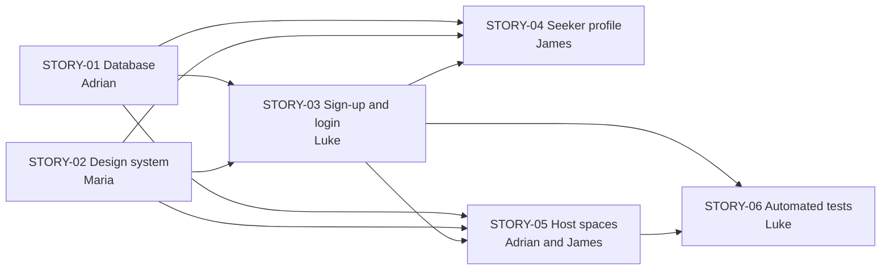

# Sprint 1 brief

**Sprint 1 · Saturday 26 September to Friday 9 October 2026 · Read all of it before you
start.**

This page tells each of us what to do in Sprint 1, in plain English:

- how to set up;
- what your part is;
- who you are waiting for;
- how to test your work;
- when to ask for help.

Read the whole page, not only your own section. Your work depends on everyone else's.

The official course version, with points and task lists, is the
[Sprint 1 plan](course/StudyHub_Sprint_1_Plan.md). If this page disagrees with your story
issue or with [`AGENTS.md`](../AGENTS.md), ask Adrian, and one of them gets fixed.

## The short version

1. **Set up your machine** with your AI tool (section 1).
2. **Read your part** (section 5) and the map of who waits for whom (section 4).
3. **Plan before you build.** Write your story's design doc. No code until Adrian merges
   it.
4. **Build in small pull requests**, with tests. Run `npm run check` before every push.
5. **Stuck or unsure? Ask Adrian.** Don't guess.

## What we are building this sprint

We're building **Worq** (codename StudyHub in the repository and the course documents).
Sprint 1 is the Midterm "walking skeleton": the thinnest version of the app that works
from end to end. It doesn't find or hold seats yet; that comes in Sprints 2 and 3.

By Friday 9 October, anyone watching our demo should see this:

- A public landing page that works on a phone, a tablet and a laptop.
- Someone signs up as a **Seeker** or a **Host**, and logs in.
- They land on **their own dashboard**, and can't open another role's pages.
- A Seeker edits their **profile** (name and phone number), and it's still there after a
  refresh.
- A Host **creates, edits and deletes a Space**.
- Behind it all, the **database itself** refuses anyone who tries to read or change
  someone else's data.

The Midterm also asks for a screenshot of the board and a 3-minute retrospective video.
We record the video together at the end of the sprint.

## 1. Set up your machine first

Do this before you arrive on Saturday if you can. If you can't, it's the first thing we
do there. If you already set up, run it again: it only checks and fixes, and it takes a
few minutes.

**Have ready:**

- Your laptop and charger.
- Git and **Node 24**.
- Your GitHub login, with the email you commit with **verified** on GitHub
  (<https://github.com/settings/emails>). Commits from an unverified email don't count as
  yours, and the Final phase checks who wrote the code.
- An AI tool that works inside a folder: Claude Code, Gemini CLI, Antigravity or Codex.

**Then:**

1. Clone the repository, and open your AI tool inside the `studyhub` folder:

   ```bash
   git clone https://github.com/dreeyanzz/studyhub.git
   ```

2. Tell it: **"Read docs/ONBOARDING.md and set up my machine."**
3. Answer its questions. You are a **cloud-dev user**. Only Adrian is the database owner.
4. When it asks for the cloud database keys, Adrian sends them to you **privately**. Paste
   them into `.env.local` yourself. Never post keys in the group chat, and never commit
   `.env.local`. If the keys aren't ready yet, the AI skips that step; that's fine.

**You're done when:**

- `npm run check` passes.
- `npm run dev` shows the app at <http://localhost:3000>.
- You ask your AI "What must a branch be named in this repository?" and it answers
  `feature/STORY-xx-short-desc`.

Then read [`AGENTS.md`](../AGENTS.md). It takes about ten minutes, and it holds the rules
that every AI tool and every one of us follows.

## 2. Plan first, then build

Every story follows the same path. **No code for a story until its design doc is
merged** (D-016).

**Your AI does the steps; you steer it and understand what it did.** After setup, tell
it:

> **Start my Sprint 1 story.**

It follows [the story loop](../AGENTS.md#the-story-loop). It finds your story, writes the
design doc, and stops until Adrian merges it. Then it builds one task at a time, tests
it, walks you through the change, and opens the pull request when you say go. In a new
session, say **"Continue my story."** It tells you when it is blocked, or when you need
to ask Adrian something.

What happens along the way:

1. **Plan: write a design doc.**
   - It's a one- or two-page plan for your story, in `docs/design/STORY-xx-short-desc.md`,
     copied from [the template](design/TEMPLATE.md).
   - It says what you'll build, which files and data it touches, what could go wrong, and
     how you'll test it. It also splits the work into tasks.
   - The test of a good one: someone who has never seen the code could read it and
     predict what the code does.
   - Branch `feature/STORY-xx-design`. PR title `docs(STORY-xx): design <short description>`.
   - You must understand every line of it. The Final phase asks each of us to explain our
     own work.
2. **Approval.** Adrian reviews the design doc. **His merge is the go-ahead.**
3. **Tasks.** Each row of your design's task table (§5) becomes a task issue under your
   story. Your AI creates them and puts them on the board; Maria keeps the board tidy.
4. **Build, one task at a time.** One branch and one pull request per task, each named
   `feature/STORY-xx-short-desc`. The tests go in the same pull request as the code.
5. **Test before you push:** `npm run check`. Your section below says what else to check.
6. **Pull request.** Fill in the template, move your card to Code Review, and ask for a
   review. Adrian reviews teammates' pull requests; a teammate reviews Adrian's.
7. **Merge.** Only Adrian merges. Never push to `main`.

Commits are `type(scope): subject`. PR titles are `type(STORY-xx): summary`, with the
summary in lowercase. [`CONTRIBUTING.md`](../CONTRIBUTING.md) has examples.

## 3. When to ask Adrian

Ask early. A question now costs minutes; a wrong guess costs days. Ask when:

- you don't understand what your story is asking for;
- your work would change another person's files, the database, or a decision in
  [`DECISIONS.md`](DECISIONS.md);
- your plan needs to change after it was approved;
- you're waiting on someone and have nothing else useful to do;
- you've been stuck for about an hour;
- your AI suggests something that goes against `AGENTS.md` or your design doc;
- anything involves keys, passwords or the shared database.

Ask in the group chat, or comment on your story's issue so the answer stays with the
story. If the answer changes other people's work, Adrian opens a `decision-needed` issue.

## 4. Who waits for whom

STORY-01 (the database) comes first, because most other stories save or read data.
STORY-02 (the design system) needs nothing from anyone, and everyone's pages use its
buttons and inputs.



| Story                                   | Owner                                    | Can start now?                                         | Waits for                                                               |
| --------------------------------------- | ---------------------------------------- | ------------------------------------------------------ | ----------------------------------------------------------------------- |
| STORY-01 Database and security rules    | Adrian                                   | Yes, all of it                                         | A teammate's approval of its design (PR #83)                            |
| STORY-02 Design system and public pages | Maria                                    | Yes, all of it                                         | Nothing                                                                 |
| STORY-03 Sign-up, login and route guard | Luke                                     | The design doc, form rules and guard logic, with tests | STORY-01 to sign up and log in for real; STORY-02's inputs and buttons  |
| STORY-04 Seeker portal and profile      | James                                    | The design doc and the page layout                     | STORY-01 to save a profile; STORY-03 to know who is signed in           |
| STORY-05 Host portal and spaces         | Adrian (design, database), James (pages) | The design doc                                         | STORY-01's `spaces` table; STORY-03 for signed-in Hosts                 |
| STORY-06 Automated tests                | Luke                                     | The design doc                                         | STORY-03 and STORY-05 for the rules it tests; STORY-01 and 03 to log in |

**While you wait,** don't sit idle. Write your design doc, build the parts that don't need
the missing piece, or review someone's pull request.

## 5. Your part

Words used below:

- **Row-Level Security (RLS):** rules inside the database that decide which rows each
  signed-in person may read or change. Even if our website has a bug, the database still
  says no.
- **Seeded accounts:** invented test accounts loaded into the database for everyone to
  use, like `seeker@example.test` and `host@example.test`.
- **Zod schema:** the rules for a form's input, for example "a password has at least 8
  characters". The same rules run in the browser and again on the server.
- **Server Action:** the function on the server that a form calls to save data.

### Adrian: STORY-01, the database and its security rules (#50)

**In plain English.** Build the database the whole app stands on:

- a table of people's profiles and a table of spaces;
- the rules that decide who can see or change each row;
- an automatic step that creates a profile when someone signs up, and never lets anyone
  make themselves an Administrator;
- the seeded test accounts;
- the two small files the app uses to talk to the database, `lib/supabase/client.ts` and
  `lib/supabase/server.ts`.

**Done when:**

- a fresh database builds cleanly with `npm run db:reset`;
- signing up creates exactly one profile, as a Seeker or a Host, never an Administrator;
- a user can't read or change another user's private profile, and can't change their own
  role;
- the `spaces` table and its rules exist, with the fields in D-027;
- the connection files, the generated types and the seeded accounts are merged, and the
  `db` check runs in CI.

**Then, for the team:** migrate the shared cloud database from `main`, make sure the
seeded Seeker and Host accounts exist there, and send each teammate the keys privately.
Luke and James can't sign up, log in or save anything for real until this happens, so it
is the first thing to finish.

**Needs from others:** a teammate approves the STORY-01 design (PR #83), so you can merge
it. Its fields are already settled (D-027).

**How to test:** pgTAP tests, run with `npm run db:test`. For each table, test three
things: the right user can do it; the wrong user gets zero rows; the owner can't make a
forbidden change to their own row, such as changing their role. Watch each new test fail
once before you trust it.

**Also:** write STORY-05's design doc (see below).

### Maria: STORY-02, the design system and the public pages (#51)

**In plain English.** Decide how Worq looks, once, so that everyone's pages match:

- the colors, text sizes and spacing (called design tokens);
- the building blocks everyone uses: Button, Input, Label, Card, Badge and Alert;
- the public pages anyone sees before signing in: the landing page, the header and the
  footer.

Everything must work with only a keyboard, stay readable for people with low vision, and
fit any screen.

**Done when:**

- text has a contrast ratio of at least 4.5:1 against its background;
- every button and link is at least 48×48 px, so it's easy to tap;
- Tab, Shift+Tab, Enter and Space reach every control, and you can always see where the
  focus is;
- the landing page, header and footer fit at 360, 768 and 1024 px wide without scrolling
  sideways.

**Needs from others:** nothing. You can start right away.

**Others need from you:** everyone's forms use your building blocks. Ship the tokens and
the building blocks in your first pull request, before the landing page, so Luke and
James can use them early. The header's "Log in" and "Sign up" links can stay simple until
Luke's STORY-03 lands.

**How to test:**

- `npm run check`.
- In your browser's developer tools, switch the width to 360, 768 and 1024 px, and check
  that nothing scrolls sideways.
- Put the mouse away and tab through every page.
- Check contrast with the developer tools' color picker or a Lighthouse accessibility
  audit.

**Also:** you keep the board current. Move cards as work starts and pull requests open,
add the task issues from each merged design doc, and take the board screenshot for the
Midterm.

### Luke: STORY-03, sign-up, login and the route guard (#52)

**In plain English.** People create an account, choosing whether they are a Seeker or a
Host, and log in.

- After logging in, they land on their own dashboard.
- If they open another role's pages (a Seeker typing `/host`, say), they are sent back to
  their own.
- Someone who isn't logged in and opens a dashboard is sent to the login page, then
  brought back after logging in.
- The form rules (a valid email; a password of at least 8 characters with a number and a
  symbol) are checked in the browser and again on the server.

The redirects happen in `proxy.ts`, a small file that runs before each page loads. It
keeps people signed in and points them to the right place. It is **not** the security;
STORY-01's database rules are. If `proxy.ts` disappeared, the data must still be safe.

**Done when:**

- `/login` and `/register` work against Supabase Auth;
- the form rules live in `lib/validation/auth.ts` and run in both places;
- the redirects work for anonymous users, Seekers and Hosts;
- the "who may open which page" logic lives in `lib/auth/role-guard.ts`, with its tests
  next to it;
- a tampered sign-up request can't create an Administrator.

**Can start now:** the design doc, the form rules and the role-guard logic, with their
tests. None of those need the database.

**Waits for:** STORY-01's connection files, sign-up step and cloud keys before sign-up
and login work for real; STORY-02's inputs and buttons for the forms.

**Question for Saturday:** can an Administrator open every portal, or only `/admin`?
STORY-06 assumes every portal. Your design doc settles it.

**How to test:**

- Vitest tests for every form rule and every role-guard case (`npm test`).
- By hand: sign up as a new Seeker and a new Host with invented `@example.test` emails,
  then try opening the other role's pages.

### Luke: STORY-06, automated tests (#55)

STORY-06 moved from James to Luke, to balance the load.

**In plain English.** Automatic checks that catch mistakes before they reach `main`:

- tests for the form rules and the route guard;
- one "robot" test (Playwright) that opens a real browser, logs in as each seeded
  account, and checks that it lands on the right page.

**Done when:**

- Vitest covers the sign-up and login rules (valid email, weak passwords, role values)
  and the space form's rules (required fields);
- the role-guard tests cover anonymous users, Seekers, Hosts and Administrators on
  `/seeker`, `/host` and `/admin`;
- `npm run check` is green on your machine and in CI;
- a Playwright test signs in as each seeded role. Your design doc decides whether it
  runs in CI.

**Waits for:** STORY-03 for the rules and the guard (you write those tests with STORY-03
anyway); STORY-05 for the space form's rules; STORY-01 and STORY-03 before the Playwright
test can log in.

**How to test your tests:** break the code on purpose, check that the test goes red, then
put the code back.

### James: STORY-04, the Seeker portal and profile (#53)

**In plain English.** The Seeker's home page after logging in.

- It shows their name and role.
- It lets them edit their name and phone number.
- Saving goes to the database and survives a page refresh.
- Placeholder cards say what's coming: search in Sprint 2, reservations in Sprint 3.

**Done when:**

- `/seeker` shows the signed-in Seeker's profile and role;
- editing the name or phone number saves through a Server Action and survives a
  refresh;
- a try at changing the user's id or role is refused by the database, not only hidden in
  the form;
- the placeholder cards point to Sprint 2 and Sprint 3.

**Can start now:** the design doc, and the page layout with Maria's building blocks once
they merge.

**Waits for:** STORY-01's `profiles` table to save anything; STORY-03 to know who is
signed in.

**Already decided:** a profile has a name and a phone number only. Study preferences come
later, with STORY-08 (D-027).

**How to test:**

- Vitest tests for the profile form's rules.
- By hand: log in as `seeker@example.test`, edit the profile, refresh, and check that it
  stuck.
- Check the page at 360, 768 and 1024 px, and with the keyboard only.

### Adrian and James: STORY-05, the Host portal and spaces (#54)

**In plain English.** The Host's home page after logging in: a list of their spaces, and
forms to add a space, edit it, and delete it after confirming. A Host can only ever touch
their own spaces, and a space that an Administrator hasn't verified yet isn't shown to
the public (FR-5.1).

**Who does what:** Adrian writes the design doc and the database side (the `spaces` rules
and the Server Actions). James builds the pages and the forms.

**Done when:**

- a Host creates a space and sees it in their list right away;
- a Host edits the name, address and hours of their own space;
- a Host deletes their own space after confirming;
- another Host can't edit or delete it, and an unverified space isn't public.

**Already decided (D-027):** a space has a name, a description, an address, and one
opening and closing time used every day. It has no price and no tags in Sprint 1: tags
come with STORY-08, and the reservation fee with STORY-09.

**Waits for:** STORY-01's `spaces` table; STORY-03 for signed-in Hosts; STORY-02's
building blocks for the forms.

**How to test:**

- pgTAP: another Host gets zero rows, and an unverified space isn't public.
- By hand: log in as `host@example.test`, then create, edit and delete a space.

## 6. Saturday 26 September, on site

**By the end of the day:**

- [ ] Everyone's machine passes `npm run check` and runs `npm run dev`.
- [ ] Everyone's commits show under their own GitHub account.
- [ ] We've confirmed the STORY-01 decisions (D-027), and decided whether Administrators
      can open every portal.
- [ ] Design doc pull requests are open for STORY-01, 02 and 03, and the ones for
      STORY-04, 05 and 06 are started.
- [ ] The design docs for STORY-01 and STORY-02 are merged, so Adrian and Maria can start
      building.
- [ ] Everyone has opened one pull request and reviewed one. Design docs count.
- [ ] The board shows what's in progress, and everyone knows their next step and its
      date.

| Time       | What                                                         |
| ---------- | ------------------------------------------------------------ |
| 15 min     | Questions about this brief                                   |
| 45–60 min  | Machine setup (section 1), for anyone not done yet           |
| 20 min     | Confirm the STORY-01 decisions (D-027); decide admin access  |
| 90–120 min | Write the design docs; Adrian reviews and merges on the spot |
| 20 min     | The board, next steps, and the next check-in                 |

## 7. Sprint calendar

These are targets. If you're going to miss one, say so as soon as you know, not on the
day.

| Date       | Target                                                                                           |
| ---------- | ------------------------------------------------------------------------------------------------ |
| Sat 26 Sep | On-site day (section 6)                                                                          |
| Mon 28 Sep | All six design docs merged; their tasks on the board                                             |
| Wed 30 Sep | STORY-01 merged, the cloud database ready and the keys shared; STORY-02's building blocks merged |
| Fri 2 Oct  | STORY-02 done; sign-up and login working in STORY-03                                             |
| Mon 5 Oct  | STORY-03 merged                                                                                  |
| Wed 7 Oct  | STORY-04 and STORY-05 merged                                                                     |
| Thu 8 Oct  | STORY-06 green; a full walkthrough as each role; fix what we find; the board screenshot          |
| Fri 9 Oct  | Sprint 1 review and demo; record the 3-minute retrospective video                                |

## 8. Rules we never break

- Never push to `main`, and never force-push. Only Adrian merges.
- Branches are named `feature/STORY-xx-short-desc`.
- Invented test data only: invented names and `@example.test` emails (D-013).
- Keys go only in your own `.env.local`: never in chat, commits or screenshots.
- If an AI helped, say so in the pull request's "AI assistance" section and add its
  `Co-Authored-By:` line. You own the work, and you must be able to explain every line.

Something here unclear or wrong? Tell Adrian. This page gets fixed in a pull request like
everything else.
