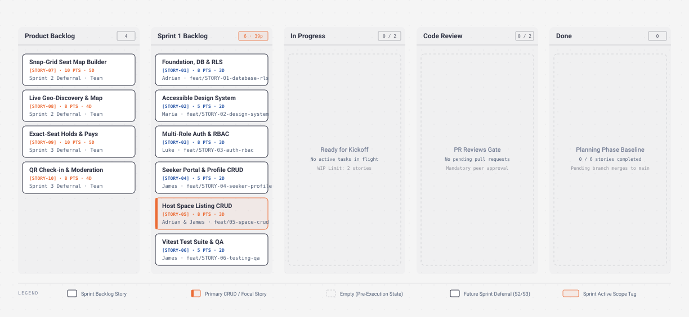

# StudyHub — Sprint 1 Execution Plan (Foundation & Identity)

> **Course**: CPEPE361 (Software Development 1)  
> **Phase**: Midterm Phase — Sprint 1 Review (Walking Skeleton Baseline)  
> **Sprint Duration**: 2 Weeks (Weeks 6–7)  
> **Development Lifecycle**: Sprint 1 of 3
>
> - **Sprint 1 (Midterm)**: Foundation, Identity & Primary CRUD (Walking Skeleton)
> - **Sprint 2 (Prefinal)**: Space Discovery & Snap-Grid Seat Map Builder
> - **Sprint 3 (Final)**: Exact-Seat Holds, Sandbox Payments, Check-in & Moderation  
>   **Status**: Planning & Review Baseline

---

## 1. Sprint Goal & Walking Skeleton Baseline

Deliver the official **Walking Skeleton Baseline** for StudyHub as mandated by the CPEPE361 Midterm Phase specification:

1. **Managed Database Connection**: Supabase PostgreSQL with robust schemas, automated trigger functions, and Row-Level Security (RLS) enforcement.
2. **Multi-Role Authentication**: Supabase Auth with custom user roles (`seeker`, `host`, `admin`), Row-Level Security as the security boundary, and Next.js SSR session refresh and route redirects in `proxy.ts`.
3. **Primary End-to-End CRUD Flows**:
   - **User Profile CRUD**: View and edit user personal info, contact numbers, and preferences.
   - **Host Space Listing CRUD**: Host creation, viewing, updating, and deletion of basic study hub/co-working venue details (name, location, description, operating hours, base hourly rate, and amenity tags).
4. **Accessible UI Shell**: Next.js 16 App Router layout, WCAG 2.1 AA compliant design tokens, and shadcn/ui accessible primitives (built on Base UI).
5. **Quality Assurance**: Automated Vitest unit test suite covering input validation schemas and RBAC route guard logic.

---

## 2. Team Workload & Domain Distribution

| Developer                | Role & Primary Domain                 | Story Responsibility & Deliverables                                                                                                                                                                                                                                                                                          |
| ------------------------ | ------------------------------------- | ---------------------------------------------------------------------------------------------------------------------------------------------------------------------------------------------------------------------------------------------------------------------------------------------------------------------------- |
| **Adrian Seth Tabotabo** | **Backend Lead & Database Architect** | **STORY-01 & STORY-05**: Database migrations (`profiles`, `spaces` tables, `user_role` ENUM), RLS policies, trigger `handle_new_user()`, seed data fixtures, pgTAP policy tests, Space Listing backend Server Actions.                                                                                                       |
| **Maria Faith Antigua**  | **Frontend Design System Lead**       | **STORY-02**: Next.js App Router config, Tailwind 4 token system in the `@theme` block of `app/globals.css` (WCAG 2.1 AA contrast $\ge 4.5:1$, $\ge 48\text{px}$ touch targets), shadcn/ui accessible primitives on Base UI (`Button`, `Input`, `Label`, `Card`, `Badge`, `Alert`), public landing hero, navbar, and footer. |
| **Luke Miguel Dongque**  | **Auth & Security Specialist**        | **STORY-03 & STORY-06**: Authentication interfaces (`/login`, `/register`), interactive Seeker vs. Host role selector card, client & server Zod validation schemas, root `proxy.ts` session guard, with RLS as the security boundary; Vitest unit testing suite and Playwright smoke tests.                                 |
| **James Niño Mandawe**   | **Portal Shells & QA Engineer**       | **STORY-04 & STORY-05 (pages)**: Authenticated Seeker dashboard layout (`/seeker`), profile view/update form, Host portal layout (`/host`) and space listing forms, DoD compliance verification.                                                                                                                            |

---

## 3. Product Backlog with MoSCoW Prioritization

To satisfy the CPEPE361 Prelim & Midterm requirements, the product features are categorized using MoSCoW prioritization, clearly delineating Sprint 1's walking skeleton from Sprint 2 and Sprint 3 deliverables:

| Priority            | Feature / User Need                     | Target Sprint | Description                                                                                                                      |
| ------------------- | --------------------------------------- | ------------- | -------------------------------------------------------------------------------------------------------------------------------- |
| **Must Have (M)**   | Multi-Role Authentication               | **Sprint 1**  | Email/password login and registration with explicit role selection (`seeker` vs. `host`), blocking client escalation to `admin`. |
| **Must Have (M)**   | Database Schemas & Row-Level Security   | **Sprint 1**  | PostgreSQL tables for `profiles` and `spaces` with 1:1 user links, cascade deletes, and RLS preventing cross-tenant mutation.    |
| **Must Have (M)**   | RBAC Route Guard Middleware             | **Sprint 1**  | Server-side session verification protecting `/seeker/*`, `/host/*`, and `/admin/*` routes from unauthorized roles.               |
| **Must Have (M)**   | Primary CRUD 1: User Profile Management | **Sprint 1**  | Seekers and Hosts can read and update their own full name, phone number, and preferences.                                        |
| **Must Have (M)**   | Primary CRUD 2: Host Space Listing CRUD | **Sprint 1**  | Hosts can create, view, update, and delete basic study space listings (name, address, rate, hours, amenities).                   |
| **Should Have (S)** | WCAG 2.1 AA Design System & Shell       | **Sprint 1**  | Accessible color tokens, keyboard navigation focus rings, mobile-responsive layout, and public landing hero.                     |
| **Should Have (S)** | Automated Unit Testing Suite            | **Sprint 1**  | Vitest test coverage for auth form validations, password constraints, and role-guard redirection logic.                          |
| **Should Have (S)** | Test Data Seeding                       | **Sprint 1**  | `seed.sql` script with reproducible Admin, Host, and Seeker accounts and sample venue records.                                   |
| **Could Have (C)**  | Amenity Multi-Select Badges             | **Sprint 1**  | Interactive toggles for Wi-Fi speed tier, power outlet accessibility, aircon, and quiet zone tags on space listings.             |
| **Could Have (C)**  | Admin Console Shell                     | **Sprint 1**  | Read-only administrative dashboard displaying registered user counts and database health metrics.                                |
| **Won't Have (W)**  | Interactive Snap-Grid Seat Map Builder  | _Sprint 2_    | Visual canvas/grid for hosts to place desks, power sockets, and zones (deferred to Sprint 2).                                    |
| **Won't Have (W)**  | Live Geo-Search & Interactive Map       | _Sprint 2_    | Leaflet/OpenStreetMap discovery with live distance calculation and amenity filtering (deferred to Sprint 2).                        |
| **Won't Have (W)**  | Image Storage & Venue Photo Uploads     | _Sprint 2_    | Supabase Storage bucket integration for space photography (deferred to Sprint 2).                                                |
| **Won't Have (W)**  | Reserve-Now Seat Holds & Timed Locks    | _Sprint 3_    | Atomic PostgreSQL transaction holding open seats, with a payment window and a seeker-set wait window (deferred to Sprint 3).                                |
| **Won't Have (W)**  | Sandbox Reservation Fee Payments        | _Sprint 3_    | Mock payment gateway with forfeiture on no-show and admin refund workflows (deferred to Sprint 3).                               |
| **Won't Have (W)**  | QR Check-in & Review Moderation         | _Sprint 3_    | Host QR scanner verification and moderation dispute console (deferred to Sprint 3).                                              |

---

## 4. Sprint 1 User Stories & Task Decomposition

In accordance with the CPEPE361 Task Decomposition Spec, every user story includes an identifier, agile user narrative, story point estimate (scale 1–10), time estimate, a single assigned owner, a Git branch prefix, granular task breakdown, and acceptance criteria. Each story starts with a merged design doc on `feature/STORY-xx-design`, and each task then ships as its own pull request from its own `feature/STORY-xx-short-desc` branch.

---

### [STORY-00] Repository Foundation & Team Conventions

- **Story**: _As a team, we want a configured repository, an agreed workflow, and a working scaffold, so that every later story starts from the same baseline._
- **Story Points**: `5 / 10`
- **Time Estimate**: `3 Days`
- **Assignee**: `Adrian Seth Tabotabo`
- **Git Branch**: `feature/STORY-00-short-desc` (one per task)
- **MoSCoW**: `Must Have`

#### Granular Tasks:

1. `TSK-00.1` (#61) Configure repository settings and the two `main` rulesets.
2. `TSK-00.2` (#62) Rebuild the project board, labels, milestones, and story issues.
3. `TSK-00.3` (#63) Move the course documents into `docs/course/` — **merged** (PR #68).
4. `TSK-00.4` (#64) Scaffold Next.js 16, shadcn/ui, Supabase, and CI — **merged** (PR #69).
5. `TSK-00.5` (#65) Add `AGENTS.md`, the decisions log, the glossary, and the templates.
6. `TSK-00.6` (#66) Add the onboarding, development, and team guides.
7. `TSK-00.7` (#67) Align the Sprint plan, README, and worksheet with the SRS and the decisions.

#### Acceptance Criteria:

- [ ] `main` is protected, and every change lands through a reviewed, squash-merged pull request.
- [ ] `npm run check` and `npm run build` pass on a fresh clone.
- [ ] No document in the repository contradicts the SRS or the decisions log.

---

### [STORY-01] Foundation, Database Schemas & Row-Level Security

- **Story**: _As a developer, I want a robust Supabase PostgreSQL schema with RLS and automated triggers, so that user profiles and space listings are securely isolated and persisted._
- **Story Points**: `8 / 10`
- **Time Estimate**: `3 Days`
- **Assignee**: `Adrian Seth Tabotabo`
- **Git Branch**: `feature/STORY-01-database-rls`
- **MoSCoW**: `Must Have`

#### Granular Tasks:

1. Bind the Supabase environment variables already scaffolded in STORY-00 (`NEXT_PUBLIC_SUPABASE_URL`, `NEXT_PUBLIC_SUPABASE_PUBLISHABLE_KEY`; `SUPABASE_SECRET_KEY` stays server-only).
2. Write migration `20260914000001_init_auth_and_profiles.sql` defining `user_role` ENUM (`seeker`, `host`, `admin`) and `public.profiles` table linked 1:1 to `auth.users(id)`.
3. Implement `handle_new_user()` PostgreSQL trigger function extracting role metadata upon signup and sanitizing against client-side `admin` self-promotion.
4. Define `public.spaces` table with fields: `id`, `host_id` (FK to profiles), `name`, `description`, `address`, `hourly_rate`, `operating_hours`, `amenities` (text array), `status`, and timestamps.
5. Configure Row-Level Security (RLS) policies:
   - `profiles`: Public select, self-update only, admin full oversight.
   - `spaces`: Public select for active spaces, host insert/update/delete restricted to `host_id = auth.uid()`.
6. Create `supabase/seed.sql` with reproducible invented test accounts (`admin@example.test`, seeded locally only, `host@example.test`, `seeker@example.test`).
7. Generate TypeScript database definitions with `npm run db:types` (`lib/supabase/database.types.ts`).
8. Add the Supabase SSR client factories (`lib/supabase/client.ts`, `lib/supabase/server.ts`) that STORY-03, STORY-04 and STORY-05 build on.

#### Acceptance Criteria:

- [ ] Database migration executes cleanly without warnings or foreign-key anomalies.
- [ ] RLS rejects any unauthorized cross-account profile update attempt.
- [ ] User signup automatically creates a matching row in `public.profiles`.

---

### [STORY-02] Accessible Design System & Public Shell

- **Story**: _As a public visitor, I want an accessible, responsive landing page and clean UI components, so that I can understand StudyHub's value proposition and navigate seamlessly._
- **Story Points**: `5 / 10`
- **Time Estimate**: `2 Days`
- **Assignee**: `Maria Faith Antigua`
- **Git Branch**: `feature/STORY-02-design-system`
- **MoSCoW**: `Should Have`

#### Granular Tasks:

1. Configure Tailwind 4 design tokens in the `@theme` block of `app/globals.css`, ensuring WCAG 2.1 AA compliance with minimum $4.5:1$ text contrast.
2. Add accessible shadcn/ui primitives on Base UI (`npx shadcn add`): `Button`, `Input`, `Label`, `Card`, `Badge`, `Alert`, with visible keyboard focus rings.
3. Build responsive public navigation header with dynamic login/register state.
4. Build landing page (`/`) showcasing StudyHub's 3 core value pillars:
   - _Live Snap-Grid Map_ (interactive seat view preview).
   - _Verified Amenities_ (Wi-Fi tiers, power outlets, quiet zones).
   - _Reserve-Now Holds_ (guaranteed seat upon arrival).
5. Build accessible, semantic footer with platform disclaimers and navigation links.

#### Acceptance Criteria:

- [ ] All interactive elements maintain touch targets $\ge 48\text{px} \times 48\text{px}$.
- [ ] Keyboard navigation (`Tab`, `Shift+Tab`, `Enter`, `Space`) operates with visible focus indicators.
- [ ] Landing page renders responsively on mobile ($360\text{px}$), tablet ($768\text{px}$), and desktop ($1024\text{px}$) without horizontal scrolling.

---

### [STORY-03] Multi-Role Authentication, Registration & RBAC Middleware

- **Story**: _As a user, I want to register as either a Seeker or a Host and log in securely, so that I am authenticated and routed to my role-specific dashboard with protected access._
- **Story Points**: `8 / 10`
- **Time Estimate**: `3 Days`
- **Assignee**: `Luke Miguel Dongque`
- **Git Branch**: `feature/STORY-03-auth-rbac`
- **MoSCoW**: `Must Have`

#### Granular Tasks:

1. Build the session helper `lib/supabase/proxy.ts` on STORY-01's client factories (`lib/supabase/client.ts`, `server.ts`).
2. Build Zod validation schemas (`lib/validation/auth.ts`) validating email formats, password complexity ($\ge 8$ chars, numbers, symbols), and role selection.
3. Build `/login` page with reactive client state, loading indicators, and error alert banners.
4. Build `/register` page featuring an interactive Role Selector Card (Seeker vs. Host) with contextual explanatory copy.
5. Implement root `proxy.ts` (Next 16's replacement for `middleware.ts`), refreshing the session and applying RBAC redirects, with RLS as the real boundary:
   - Anonymous users attempting to access `/seeker/*`, `/host/*`, or `/admin/*` are redirected to `/login`.
   - Logged-in Seekers accessing `/host/*` or `/admin/*` are routed back to `/seeker`.
   - Logged-in Hosts accessing `/admin/*` or `/seeker/*` are routed back to `/host`.
6. Implement safe post-login redirection based on authenticated user role.

#### Acceptance Criteria:

- [ ] Unauthenticated requests to `/seeker`, `/host`, or `/admin` redirect to `/login` with a `returnUrl` parameter.
- [ ] Seeker registration assigns `seeker` role; Host registration assigns `host` role.
- [ ] Role escalation via tampered request metadata is rejected at the database trigger layer.

---

### [STORY-04] Seeker Portal & User Profile CRUD

- **Story**: _As a Seeker, I want to access my personal dashboard and view/update my profile details, so that my account information and contact preferences remain accurate._
- **Story Points**: `5 / 10`
- **Time Estimate**: `2 Days`
- **Assignee**: `James Niño Mandawe`
- **Git Branch**: `feature/STORY-04-seeker-profile-crud`
- **MoSCoW**: `Must Have`

#### Granular Tasks:

1. Build authenticated dashboard shell (`app/(dashboard)/seeker/layout.tsx` and `components/dashboard-header.tsx`).
2. Construct Seeker dashboard view (`app/(dashboard)/seeker/page.tsx`) showing account status, role badge, and quick stats.
3. Implement Profile Edit form allowing users to update their `full_name`, `phone_number`, and study preference tags.
4. Wire form submission to Supabase `profiles` table update action with optimistic UI state and toast/alert feedback.
5. Display informational placeholder cards highlighting upcoming Sprint 2 (Search Spaces) and Sprint 3 (Active Reservations) features.

#### Acceptance Criteria:

- [ ] Profile details load automatically for the currently logged-in user.
- [ ] Updating full name or phone number persists immediately to the database and reflects upon page refresh.
- [ ] Attempts to alter user ID or role during update are rejected.

---

### [STORY-05] Host Portal & Space Listing CRUD

- **Story**: _As a Host, I want to create, view, edit, and delete basic study space listings in my portal, so that I can represent my venue to prospective seekers._
- **Story Points**: `8 / 10`
- **Time Estimate**: `3 Days`
- **Assignee**: `Adrian Seth Tabotabo`
- **Git Branch**: `feature/STORY-05-host-space-crud`
- **MoSCoW**: `Must Have`

#### Granular Tasks:

1. Build Host portal shell (`app/(dashboard)/host/layout.tsx`) with host navigation and logout button.
2. Build Host space management dashboard (`app/(dashboard)/host/page.tsx`) listing all spaces owned by the authenticated host.
3. Implement "Create Space Listing" modal/form:
   - Space Name (`text`, required).
   - Address / Location (`text`, required).
   - Description (`textarea`).
   - Operating Hours (`text`, e.g., "7:00 AM - 11:00 PM").
   - Base Hourly Rate (`numeric`, PHP).
   - Amenity Checkbox Tags (High-Speed Wi-Fi, Dedicated Outlets, Air Conditioning, Quiet Zone).
4. Implement "Edit Space Listing" dialog allowing hosts to modify existing listing details.
5. Implement "Delete Space" confirmation dialog ensuring safe deletion of unneeded listings.
6. Enforce RLS verification ensuring hosts can neither view unapproved draft listings of other hosts nor modify other hosts' venues.

#### Acceptance Criteria:

- [ ] Host can create a new space listing and see it appear immediately in their space list.
- [ ] Host can update the name, rate, or amenities of their own listing.
- [ ] Host can delete their listing with confirmation.
- [ ] Non-owners cannot edit or delete spaces belonging to another host.

---

### [STORY-06] Automated Unit Testing & QA Verification Suite

- **Story**: _As a QA engineer, I want automated unit tests for validation schemas and route guard logic, so that our codebase maintains high reliability and passes the Definition of Done._
- **Story Points**: `5 / 10`
- **Time Estimate**: `2 Days`
- **Assignee**: `Luke Miguel Dongque`
- **Git Branch**: `feature/STORY-06-testing-qa`
- **MoSCoW**: `Should Have`

#### Granular Tasks:

1. Extend the Vitest harness scaffolded in STORY-00 (`vitest.config.mts`).
2. Write unit tests for the authentication validation schemas next to the code (`lib/validation/auth.test.ts`):
   - Validates valid email, weak passwords (< 8 chars, missing numbers), and role enumeration.
3. Write unit tests for the RBAC route guard logic next to the code (`lib/auth/role-guard.test.ts`):
   - Tests unauthenticated redirection to `/login`.
   - Tests Seeker access permissions (allow `/seeker`, deny `/host`, deny `/admin`).
   - Tests Host access permissions (allow `/host`, deny `/seeker`, deny `/admin`).
   - Tests Admin access permissions across all portals.
4. Write validation tests for Space Listing schema (ensuring positive rates, non-empty titles).
5. Run the repository checks before every push: `npm run check` (typecheck, lint, format check, unit tests) and `npm run db:test` (pgTAP policy tests).

#### Acceptance Criteria:

- [ ] `npm run check` passes (typecheck, lint, format check, and all Vitest unit tests).
- [ ] `npm run db:test` passes (pgTAP policy tests, including the negative tests).
- [ ] `npm run build` succeeds, matching the `checks` job in CI.

---

## 5. Project Management Board Mapping (GitHub Projects)

In compliance with the CPEPE361 brief, below is the visual state mapping of all user story cards across the **5 required project board columns**:



_(Interactive version with HTML summary cards: [StudyHub_Project_Management_Board.html](./StudyHub_Project_Management_Board.html))_

<details>
<summary>📋 Click to expand plain-text ASCII Board for manual copy-pasting</summary>

```
+--------------------+--------------------+--------------------------+------------------------------+--------------------+
|  PRODUCT BACKLOG   |  SPRINT 1 BACKLOG  |       IN PROGRESS        |         CODE REVIEW          |        DONE        |
+--------------------+--------------------+--------------------------+------------------------------+--------------------+
| [STORY-07]         | [STORY-01]         | [STORY-00]               |                              |                    |
| Snap-Grid Seat Map | Foundation, DB &   | Repo Foundation &        | (PR Review Gate)             | (Baseline State)   |
| Builder (Sprint 2) | RLS Policies       | Team Conventions         |                              |                    |
| Points: 10         | Est: 3d | Pts: 8   | Est: 3d | Pts: 5         | No pending PRs               | 0 stories complete |
|                    | Assignee: Adrian   | Assignee: Adrian         | Adrian squash-merges         | Pending merges     |
| [STORY-08]         |                    | WIP limit: 4             |                              |                    |
| Live Geo-Discovery | [STORY-02]         | Issue #49 - 2 of 7 tasks |                              |                    |
| & Map (Sprint 2)   | Design System &    |                          |                              |                    |
| Points: 8          | Public Shell       |                          |                              |                    |
|                    | Est: 2d | Pts: 5   |                          |                              |                    |
| [STORY-09]         | Assignee: Maria    |                          |                              |                    |
| Exact-Seat Holds & |                    |                          |                              |                    |
| Payments (Sprint 3)| [STORY-03]         |                          |                              |                    |
| Points: 10         | Multi-Role Auth &  |                          |                              |                    |
|                    | RBAC Middleware    |                          |                              |                    |
| [STORY-10]         | Est: 3d | Pts: 8   |                          |                              |                    |
| QR Check-in &      | Assignee: Luke     |                          |                              |                    |
| Moderation (S3)    |                    |                          |                              |                    |
| Points: 8          | [STORY-04]         |                          |                              |                    |
|                    | Seeker Dashboard & |                          |                              |                    |
|                    | Profile CRUD       |                          |                              |                    |
|                    | Est: 2d | Pts: 5   |                          |                              |                    |
|                    | Assignee: James    |                          |                              |                    |
|                    |                    |                          |                              |                    |
|                    | [STORY-05]         |                          |                              |                    |
|                    | Host Space Listing |                          |                              |                    |
|                    | CRUD               |                          |                              |                    |
|                    | Est: 3d | Pts: 8   |                          |                              |                    |
|                    | Assignee: Adrian   |                          |                              |                    |
|                    |                    |                          |                              |                    |
|                    | [STORY-06]         |                          |                              |                    |
|                    | Vitest Unit Tests  |                          |                              |                    |
|                    | Est: 2d | Pts: 5   |                          |                              |                    |
|                    | Assignee: Luke     |                          |                              |                    |
+--------------------+--------------------+--------------------------+------------------------------+--------------------+
```

</details>

### Story Card Summary Table for Board Import

| Card ID    | Card Title & Description                    | Column           | Assignee                     | Story Points | Time Est. | MoSCoW          | Git Branch                             |
| ---------- | ------------------------------------------- | ---------------- | ---------------------------- | ------------ | --------- | --------------- | -------------------------------------- |
| `STORY-00` | Repository Foundation & Team Conventions    | In Progress      | Adrian Seth Tabotabo         | 5 / 10       | 3 Days    | Must Have       | `feature/STORY-00-short-desc`          |
| `STORY-01` | Foundation, Database Schemas & RLS Policies | Sprint 1 Backlog | Adrian Seth Tabotabo         | 8 / 10       | 3 Days    | Must Have       | `feature/STORY-01-database-rls`        |
| `STORY-02` | Accessible Design System & Public Shell     | Sprint 1 Backlog | Maria Faith Antigua          | 5 / 10       | 2 Days    | Should Have     | `feature/STORY-02-design-system`       |
| `STORY-03` | Multi-Role Authentication & RBAC Guard      | Sprint 1 Backlog | Luke Miguel Dongque          | 8 / 10       | 3 Days    | Must Have       | `feature/STORY-03-auth-rbac`           |
| `STORY-04` | Seeker Portal & User Profile CRUD           | Sprint 1 Backlog | James Niño Mandawe           | 5 / 10       | 2 Days    | Must Have       | `feature/STORY-04-seeker-profile-crud` |
| `STORY-05` | Host Portal & Space Listing CRUD            | Sprint 1 Backlog | Adrian Seth Tabotabo         | 8 / 10       | 3 Days    | Must Have       | `feature/STORY-05-host-space-crud`     |
| `STORY-06` | Automated Testing Suite & QA Validation     | Sprint 1 Backlog | Luke Miguel Dongque          | 5 / 10       | 2 Days    | Should Have     | `feature/STORY-06-testing-qa`          |
| `STORY-07` | Interactive Snap-Grid Seat Map Builder      | Product Backlog  | Team                         | 10 / 10      | 5 Days    | Won't Have (S1) | Defer to Sprint 2                      |
| `STORY-08` | Live Geo-Discovery & Map Tag Filters        | Product Backlog  | Team                         | 8 / 10       | 4 Days    | Won't Have (S1) | Defer to Sprint 2                      |
| `STORY-09` | Reserve-Now Seat Holds & Sandbox Payments   | Product Backlog  | Team                         | 10 / 10      | 5 Days    | Won't Have (S1) | Defer to Sprint 3                      |
| `STORY-10` | QR Check-in & Review Moderation             | Product Backlog  | Team                         | 8 / 10       | 4 Days    | Won't Have (S1) | Defer to Sprint 3                      |

**Issue mapping.** `STORY-00` #49 · `STORY-01` #50 · `STORY-02` #51 · `STORY-03` #52 · `STORY-04` #53 · `STORY-05` #54 · `STORY-06` #55 · `STORY-07` #56 · `STORY-08` #57 · `STORY-09` #58 · `STORY-10` #59. The STORY-00 tasks are `TSK-00.1` #61 · `TSK-00.2` #62 · `TSK-00.3` #63 (merged, PR #68) · `TSK-00.4` #64 (merged, PR #69) · `TSK-00.5` #65 · `TSK-00.6` #66 · `TSK-00.7` #67.

---

## 6. Definition of Done (DoD) Checklist

A user story or sprint deliverable is formally marked as **DONE** only when satisfying all criteria below:

- [ ] **Code Authorship & Branching**: Implemented on its designated `feature/STORY-xx-short-desc` branch and squash-merged to `main` by Adrian, so the PR title and body become the commit.
- [ ] **Design Gate**: The design doc for the story (`docs/design/STORY-xx-*.md`) was merged before its code started, and this pull request links it.
- [ ] **Local Checks**: `npm run check` passes (typecheck, lint, format check, Vitest), and `npm run db:test` passes when SQL changed.
- [ ] **CI**: `checks`, `pr-title`, and `db` (once migrations exist) are green.
- [ ] **Database Integrity & Security**: All table mutations protected by verified Row-Level Security policies, with negative tests; no secret key exposed to the client.
- [ ] **Accessibility & Responsiveness**: WCAG 2.1 AA compliant color contrast ($\ge 4.5:1$), touch targets $\ge 48\text{px} \times 48\text{px}$, keyboard focus rings, and no horizontal scrolling at $360$, $768$, and $1024\text{px}$.
- [ ] **Verified Criteria**: Every acceptance criterion is ticked by the named person who verified it, and the pull request says how.
- [ ] **Peer Code Review**: The pull request has been reviewed and all review threads are resolved. The required approval count is 1; Adrian approves teammates' PRs, and a teammate approves Adrian's (D-014).
- [ ] **Docs**: Any document this change makes stale is updated in the same pull request.
- [ ] **Tracking**: The issue is closed and its card is in Done.
