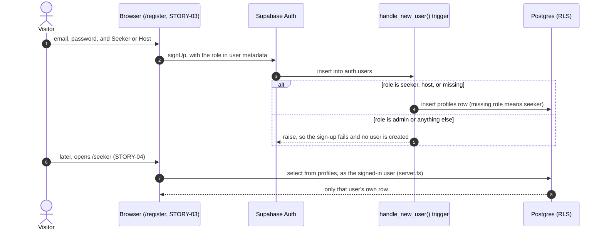

# STORY-01: Database schemas and row-level security

**Status:** draft · **Owner:** @dreeyanzz · **Story:** #50 · **FR:** SRS §3.5.1, §3.8,
FR-5.1 · **Depends on:** nothing · **Decisions:** D-007, D-013, D-017, D-019

> **Draft for the on-site day, Saturday 26 September.** Items marked **Proposal** are
> for the team to confirm. The profile fields are agreed with Luke and James, the space
> fields with James (STORY-05). See §8.

## 0. Scope

**In:**

- `profiles`: one per signed-up user, with their role.
- The sign-up trigger that creates it, which never makes anyone an Administrator.
- `spaces`, with its verification status.
- The grants and Row-Level Security (RLS) policies for both tables.
- Local seed data, the pgTAP policy tests, and the `db` CI job.
- The generated types and the two Supabase client files every later story imports.

**Out:**

- `proxy.ts` and `lib/supabase/proxy.ts`, which refresh the session and redirect (STORY-03).
- The Zod schemas, forms and Server Actions: profiles in STORY-04, spaces in STORY-05.
- Tags, zones, units, photos and map coordinates (Sprint 2).
- The Administrator's verification screen (STORY-14).
- `lib/supabase/admin.ts` (the secret key): nothing needs it yet.

## 1. Flow



## 2. Data and state

**Enums:**

- `user_role`: `seeker`, `host`, `admin`.
- `space_status`: `pending`, `verified`, `rejected` (FR-5.1). This PR adds it to the
  glossary as "Verification status".

**`profiles`**, one row per `auth.users` row:

| Column                     | Type          | Rules                                                                        |
| -------------------------- | ------------- | ---------------------------------------------------------------------------- |
| `id`                       | `uuid` PK     | References `auth.users(id)`, on delete cascade                               |
| `role`                     | `user_role`   | Not null, default `seeker`. Set by the trigger, never by the user            |
| `full_name`                | `text`        | Null allowed, at most 100 characters                                         |
| `phone_number`             | `text`        | Null allowed, at most 20 characters; STORY-04's Zod schema checks the format |
| `study_preferences`        | `text[]`      | **Proposal.** Not null, default `{}`; see §8                                 |
| `created_at`, `updated_at` | `timestamptz` | Not null, default `now()`; a trigger keeps `updated_at` current              |

**`spaces`** (**Proposal**, to confirm with STORY-05's design):

| Column                     | Type           | Rules                                                                                      |
| -------------------------- | -------------- | ------------------------------------------------------------------------------------------ |
| `id`                       | `uuid` PK      | Default `gen_random_uuid()`                                                                |
| `host_id`                  | `uuid`         | Not null, default `auth.uid()`; references `profiles(id)`, on delete cascade               |
| `name`                     | `text`         | Not null, 1–100 characters                                                                 |
| `description`              | `text`         | Null allowed, at most 2,000 characters                                                     |
| `address`                  | `text`         | Not null, 1–200 characters                                                                 |
| `opens_at`, `closes_at`    | `time`         | Not null, and not equal. A closing time earlier than the opening time means after midnight |
| `status`                   | `space_status` | Not null, default `pending`. Only an Administrator changes it (STORY-14)                   |
| `created_at`, `updated_at` | `timestamptz`  | As in `profiles`                                                                           |

There is no price column and there are no tags or coordinates yet; see §7 and §8.

**Space status:**

| From      | Event                     | To         | Who                      |
| --------- | ------------------------- | ---------- | ------------------------ |
| (none)    | A Host creates a space    | `pending`  | Host                     |
| `pending` | An Administrator approves | `verified` | Administrator (STORY-14) |
| `pending` | An Administrator rejects  | `rejected` | Administrator (STORY-14) |

Sprint 1 has no screen for the Administrator's transitions. The seed provides verified
spaces.

**Functions, in schema `private`:** the API does not expose this schema. `config.toml`
exposes only `public` and `graphql_public`.

- `private.handle_new_user()`:
  - runs after each insert on `auth.users`, as `security definer` with `search_path = ''`;
  - reads `role` and `full_name` from `raw_user_meta_data`;
  - a missing role means `seeker`, `seeker` and `host` are accepted, and anything else
    raises, so the sign-up fails.
- `private.has_role(user_role)`:
  - `security definer` and `stable`;
  - true when the caller's own profile has that role;
  - policies call it as `(select private.has_role('admin'))`, so it runs once per query.
- `private.set_updated_at()`: the trigger that keeps `updated_at` current on both tables.

**Zod schemas:** none in this story. They belong to the stories that own the forms
(STORY-03, STORY-04 and STORY-05); the database checks above are the backstop.

**Grants and RLS.** The migration first revokes everything from `anon` and
`authenticated`, then grants back only the lines below.

| Table      | Verb           | Who                 | Columns granted                                           | Policy                                                              |
| ---------- | -------------- | ------------------- | --------------------------------------------------------- | ------------------------------------------------------------------- |
| `profiles` | select         | anon, authenticated | all                                                       | Own row, or the caller is an Administrator. Anyone else gets 0 rows |
| `profiles` | update         | authenticated       | `full_name`, `phone_number`, `study_preferences`          | Own row only                                                        |
| `profiles` | insert, delete | nobody              | —                                                         | The trigger inserts; deleting the auth user cascades                |
| `spaces`   | select         | anon, authenticated | all                                                       | Verified; or own (any status); or the caller is an Administrator    |
| `spaces`   | insert         | authenticated       | `name`, `description`, `address`, `opens_at`, `closes_at` | The caller is a Host, and `host_id` is the caller                   |
| `spaces`   | update         | authenticated       | the same five columns                                     | Own spaces only                                                     |
| `spaces`   | delete         | authenticated       | —                                                         | Own spaces only                                                     |

Because `role`, `id`, `host_id` and `status` are never granted, changing them is refused
with `42501` whatever the policies say.

## 3. UI and files

This story has no routes and no UI.

```
supabase/migrations/<timestamp>_profiles.sql   npm run db:new profiles
supabase/migrations/<timestamp>_spaces.sql     npm run db:new spaces
supabase/seed.sql                              local and CI only (D-013)
supabase/tests/01-profiles.sql
supabase/tests/02-spaces.sql
lib/supabase/client.ts           browser client, for Client Components
lib/supabase/server.ts           server client, for Server Components, Server Actions and
                                 route handlers; reads the session cookies with Next 16's
                                 async cookies()
lib/supabase/database.types.ts   generated by npm run db:types
.github/workflows/ci.yml         new `db` job: start a fresh local stack, run npm run db:test
```

Both client files use the publishable key and `@supabase/ssr` 0.12, following its
Next.js guide and the Next 16 docs in `node_modules/next/dist/docs/`.

**Seed accounts:**

| Account               | Role          | Owns                               |
| --------------------- | ------------- | ---------------------------------- |
| `admin@example.test`  | Administrator | nothing                            |
| `host@example.test`   | Host          | one verified and one pending space |
| `host2@example.test`  | Host          | one verified space                 |
| `seeker@example.test` | Seeker        | nothing                            |

All four share one invented password, written in `seed.sql`, which passes STORY-03's
password rules. The cloud dev project gets no seed file. Once STORY-03 lands, Adrian
registers `host@`, `host2@` and `seeker@` there through `/register`, so they go through
the real trigger. The Administrator account never exists in a cloud project (D-013).

## 4. Security and test matrix

All pgTAP tests use the seeded accounts, and act as them with `set local role
authenticated` and `request.jwt.claims` ([testing guide](../guides/testing.md)).

| Layer  | Case                                                                       | Expected                                    |
| ------ | -------------------------------------------------------------------------- | ------------------------------------------- |
| pgTAP  | Sign-up with role `host`, `seeker`, or none                                | One profile: host, seeker, seeker           |
| pgTAP  | Sign-up with role `admin`, or an unknown value                             | The insert raises; no user, no profile      |
| pgTAP  | A Seeker reads their own profile                                           | 1 row                                       |
| pgTAP  | A Seeker reads another user's profile; an anonymous visitor reads profiles | 0 rows                                      |
| pgTAP  | An Administrator reads profiles                                            | All rows                                    |
| pgTAP  | A Seeker updates another user's profile                                    | 0 rows affected, row unchanged              |
| pgTAP  | A Seeker updates their own name                                            | Succeeds                                    |
| pgTAP  | A Seeker changes their own `role` or `id`                                  | `42501`                                     |
| pgTAP  | Anyone inserts or deletes a profile directly                               | `42501`                                     |
| pgTAP  | An anonymous visitor or a Seeker lists spaces                              | Verified spaces only                        |
| pgTAP  | A Host lists spaces                                                        | Verified spaces, plus their own pending one |
| pgTAP  | An Administrator lists spaces                                              | All spaces                                  |
| pgTAP  | A Host creates a space                                                     | Succeeds, `pending`, `host_id` is the Host  |
| pgTAP  | A Seeker creates a space                                                   | `42501`                                     |
| pgTAP  | A Host sets `status` or `host_id` on insert or update                      | `42501`                                     |
| pgTAP  | Another Host updates or deletes the Host's space                           | 0 rows affected, row unchanged              |
| pgTAP  | A Host updates and deletes their own space                                 | Succeeds                                    |
| Manual | `npm run db:reset` on a fresh stack                                        | Applies cleanly, no warnings                |
| Manual | Each seeded account signs in with its password through the Auth API        | Succeeds                                    |

Each new test is watched failing once: drop the policy, see it go red, put it back.

## 5. Tasks and estimates

| Task     | What                                                                                                        | Owner  | Points | Days | Depends on                  |
| -------- | ----------------------------------------------------------------------------------------------------------- | ------ | ------ | ---- | --------------------------- |
| TSK-01.1 | `profiles`, the sign-up trigger, `has_role`, grants, RLS, seed users, pgTAP, `db` CI job                    | Adrian | 4      | 1    | Saturday's profile fields   |
| TSK-01.2 | `spaces`, grants, RLS, seed spaces, pgTAP                                                                   | Adrian | 3      | 1    | TSK-01.1, STORY-05's design |
| TSK-01.3 | `lib/supabase/client.ts` and `server.ts`, with the generated types                                          | Adrian | 2      | 0.5  | TSK-01.1                    |
| TSK-01.4 | Cloud dev project: migrate from `main`, turn off email confirmation, share keys; make `db` a required check | Adrian | 1      | 0.5  | TSK-01.1 to 01.3 merged     |

## 6. Build order

One PR per row, and every PR targets `main`.

| #   | Branch                              | PR title                                                | Contains                           |
| --- | ----------------------------------- | ------------------------------------------------------- | ---------------------------------- |
| 1   | `feature/STORY-01-profiles`         | `feat(STORY-01): add profiles and the sign-up trigger`  | TSK-01.1, and the types so far     |
| 2   | `feature/STORY-01-supabase-clients` | `feat(STORY-01): add the supabase client factories`     | TSK-01.3. Unblocks Luke's STORY-03 |
| 3   | `feature/STORY-01-spaces`           | `feat(STORY-01): add the spaces table and its policies` | TSK-01.2, with regenerated types   |

TSK-01.4 is not a PR. Adrian does it after row 3 merges, then tells the team.

## 7. Rejected alternatives

- **Profiles readable by everyone** (the Sprint 1 plan said "public select"). This would
  expose phone numbers, and nothing in Sprint 1 shows another person's profile. Issue
  #50 requires 0 rows. A later story that shows a Host's name can add a narrow view.
- **Blocking role changes with a trigger.** Column grants are simpler, and they fail the
  same way (`42501`) for `role`, `id`, `host_id` and `status`.
- **Quietly turning a tampered `admin` into `seeker`.** This hides both bugs and
  attacks. A loud failure is easy to test.
- **Keeping the role in the session token** (a Supabase custom access token hook).
  `proxy.ts` would not need a query per request, but the role would go stale until the
  token refreshes. STORY-03's design decides. If it wants the hook, that is a later
  migration.
- **Operating hours as free text** ("7:00 AM - 11:00 PM"). The seat states need to know
  when a space closes (D-004). Two `time` columns can be compared; a sentence can't.
- **An `hourly_rate` column.** Worq charges a reservation fee (D-005), which is not a
  rate, and price is a curated filter tag (FR-1.2) that arrives with tags in Sprint 2.

## 8. Open questions for Saturday

1. **Profile fields.** Is "study preferences" worth having in Sprint 1? If yes, a
   `text[]` filled from a fixed list in STORY-04's form works now, and STORY-08 can
   switch it to curated tags. Otherwise drop it until STORY-08.
2. **Space fields (with James).** Are `opens_at` and `closes_at` enough for hours? And do
   we move tags from STORY-05 to STORY-08? Curated tags need their own tables, and search
   (STORY-08) is the first story that uses them. If tags move, STORY-05's acceptance
   criteria lose "tags".
3. **Editing a verified space.** Should it go back to `pending`? This is for STORY-14 to
   decide, not Sprint 1.

## 9. After the build

Fill this in when the story is done.
