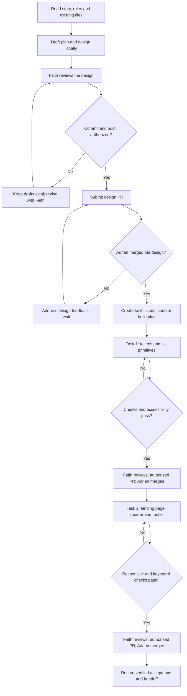
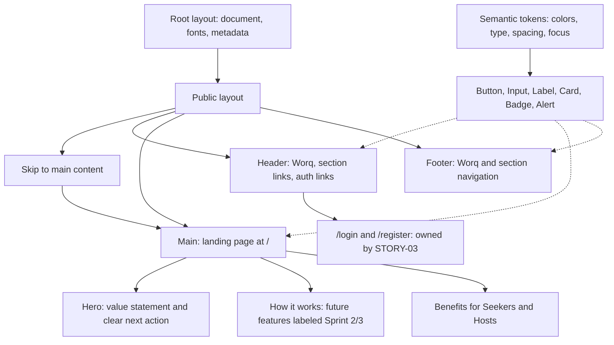

# STORY-02: AI execution plan and design diagrams

**Owner:** Maria Faith Antigua (@fayeye-09) · **Story:** [#51](https://github.com/dreeyanzz/studyhub/issues/51)
**Status:** proposed plan; no implementation started.
**Design:** [STORY-02-design-system.md](STORY-02-design-system.md)
**Sources:** SRS §3.2.2 and §3.7.1; Sprint 1 §5 (Maria); AGENTS.md story loop; D-016 and D-026.

## Working agreement

The AI prepares files and explains them; Faith reviews the choices and understands the changes. Commit and push only with Faith's authorization. Faith authorized publishing this design and plan as a documentation PR; implementation remains subject to the design gate. Adrian alone merges. No story implementation begins before the design is merged (D-016).

Use the current checkout and preserve unrelated local work. This plan supplements the design; it does not approve it or create task issues.

## Execution plan

| Stage                  | AI actions                                                                                                                                                   | Output and completion check                                                                                                        | Human checkpoint                                                              |
| ---------------------- | ------------------------------------------------------------------------------------------------------------------------------------------------------------ | ---------------------------------------------------------------------------------------------------------------------------------- | ----------------------------------------------------------------------------- |
| 1. Establish scope     | Read issue #51, current rules, SRS and design; inspect Git status and current component configuration                                                        | Confirm only public shell and shared UI are in scope; identify existing work before editing                                        | Faith reviews the scope                                                       |
| 2. Prepare design      | Refine the draft, palette, component contracts, file map and two task estimates                                                                              | A reviewable design with acceptance checks and no unsupported claims                                                               | Faith reviews this plan and design                                            |
| 3. Submit design later | With Faith's authorization, commit the design, push its feature branch and prepare the design PR                                                             | PR references #51, includes AI disclosure and requests Adrian's review                                                             | Adrian merges; until then, revise documents only                              |
| 4. Prepare task 1      | After design merge, create the two task sub-issues and board entries; start the first branch from current main                                               | TSK-02.1 In Progress; clean, scoped branch; read installed Next.js docs before code                                                | Confirm implementation plan before writing code, per AGENTS.md                |
| 5. Build foundations   | Configure semantic tokens; generate Button, Input, Label, Card, Badge and Alert using the existing shadcn style; preserve required Base UI client boundaries | Shared primitives with documented labels, error states, sizing and focus behavior; no extra component library                      | Explain the diff to Faith                                                     |
| 6. Verify foundations  | Run npm run check; inspect primitives in a temporary local fixture; measure contrast, targets and keyboard states                                            | Recorded evidence for contrast, 48 px targets, labels, invalid/disabled states and focus; remove temporary fixture before delivery | Faith reviews results and later authorizes publication; Adrian merges task 1  |
| 7. Build public shell  | Start task 2 from updated main; implement public layout, header, footer and landing page with merged primitives                                              | Route / remains stable; visible navigation wraps on mobile; public UI uses Worq                                                    | Explain each changed file to Faith                                            |
| 8. Verify public shell | Run npm run check; inspect 360/768/1024 px and enlarged text; test keyboard and skip link; check static content and link destinations                        | No horizontal overflow; correct focus and semantics; no fake inventory; record pending auth integration if STORY-03 is absent      | Faith reviews evidence and later authorizes publication; Adrian merges task 2 |
| 9. Handoff             | Record acceptance evidence and deviations in the design; update implementation status only after verified completion                                         | Shared component usage notes and final checklist; request explicit instruction before closing the story                            | Faith can explain the work; Adrian owns merge decisions                       |

The two implementation tasks total 5 points / 2 working days as a planning estimate, excluding review waits. This documentation PR requests design review. Implementation starts only after Adrian merges the design.

## Diagram 1: AI delivery workflow

## Diagram 2: proposed page and component structure

Input, Label and Alert are delivered for teammates' forms; the static landing page need not use every primitive. The page has no database or authentication state. Responsive intent: full-width stacked sections at 360 px, flexible columns where content fits at 768/1024 px, and wrapping navigation at every width that needs it. Never conceal overflow to pass the viewport check.

## Evidence required before declaring done

- Successful npm run check output with the tested revision or local diff identified.
- Screenshots at 360, 768 and 1024 px, plus a check that document width does not exceed viewport width.
- Measured foreground/background contrast for rendered text and interaction states; minimum 4.5:1.
- Target-size inspection for every interactive control; minimum 48 by 48 px.
- Keyboard record: forward/reverse focus order, Enter on links, Space on buttons, visible focus and skip-link focus transfer.
- Input label and error associations; no color-only meaning; no unnecessary tab stops.
- Explicit record of any auth destination that cannot yet complete because STORY-03 is pending.

Do not reuse old checkout test results as evidence for the new implementation. No database policy test applies because this story adds no database access. If implementation introduces pure logic, add meaningful adjacent unit tests; do not add tests that merely repeat static markup.

## Setup and synchronization record — 2026-09-26

- Created a separate current checkout to preserve earlier uncommitted work.
- Verified Node 24, npm, Git identity, GitHub authentication with project scope, dependency installation and the `.husky/_` hook path.
- Initial onboarding checks passed, including two unit tests at the earlier baseline. The placeholder landing page returned HTTP 200 at localhost:3000; the development server was stopped afterward. These are setup checks, not STORY-02 acceptance evidence.
- Copied Faith's supplied environment file locally and replaced it when she provided an update. Verified it remains ignored by Git. No values are included here; cloud connectivity and account login have not been tested.
- Fast-forwarded the design branch from `5b669d4` to `4178c5e`, bringing in STORY-01's profiles, spaces, client factories, generated types and CI type consistency check (PRs #90–#95). The local environment file and design drafts were preserved.
- STORY-02 still has no database dependency. STORY-01 is now merged; STORY-03 still owns the authentication routes. Local database checks are not run for this documentation-only change on a cloud-dev machine.

See the PR verification section for checks rerun against the synchronized checkout.
