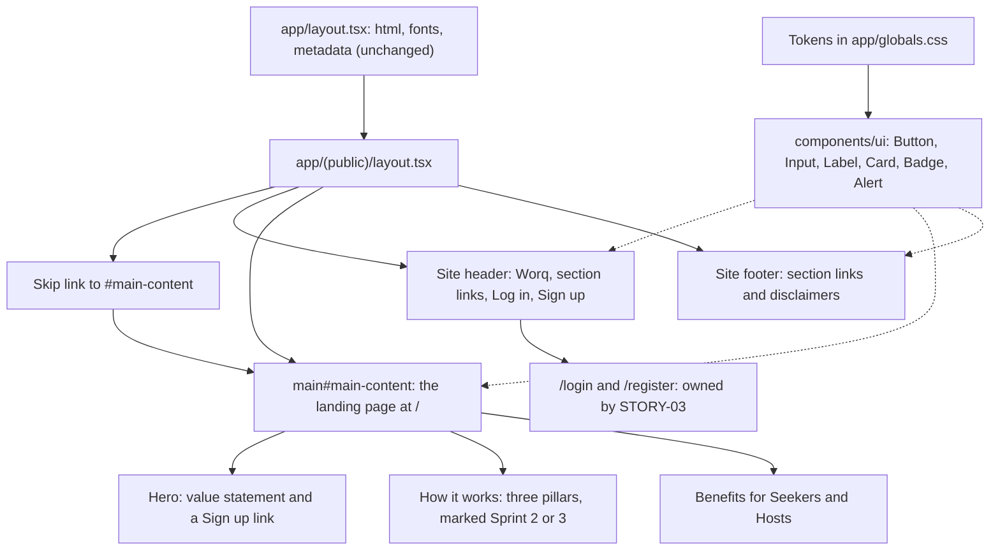

# STORY-02: Accessible design system and public shell

**Status:** approved 2026-09-26 · **Owner:** @fayeye-09 · **Story:** [#51](https://github.com/dreeyanzz/studyhub/issues/51)
**FR:** SRS §3.2.2, §3.7.1 · **Depends on:** none · **Decisions:** D-002, D-005, D-010, D-016, D-018, D-026, D-031

## 0. Scope

**In:** Tailwind 4 semantic tokens; shadcn/ui Button, Input, Label, Card, Badge and Alert; Worq landing page, public header and footer. Deliver the tokens and shared components first so STORY-03, 04 and 05 can use them.

**Out:** authentication, dashboards, database access, search/filter behavior, maps, availability and holds. Describe future discovery and reserve-now features in words, as coming in Sprint 2/3; do not display invented inventory or functional-looking search controls. Whether the header shows a signed-in state is STORY-03's call (§8).

## 1. Flow

Visitor requests `/` → Next.js renders the public layout and landing page → browser displays static content → visitor follows section links or the Log in / Sign up links (`/login`, `/register`, supplied by STORY-03). Until those routes land, authentication is a known integration dependency, not a completed journey. No Server Action, API or database participates; a cross-layer sequence diagram is unnecessary here (D-010). §3 shows the page structure instead.

## 2. Data and state

No tables, enums, policies, GRANTs, Zod schemas or persistent state. No session is read. Keep the navigation visible and allow it to wrap on small screens, avoiding menu state. Native focus, hover, disabled and invalid states belong to the primitives.

## 3. UI and files

**Look.** Forest green, warm cream and sage, with Georgia headings (falling back to `serif`) over the existing Geist body font. Light mode only: no theme switch, and the unused neutral `.dark` block in `app/globals.css` is removed (D-031). Spacing uses Tailwind's 4 px scale. Corners come from the existing `--radius` of 10 px: controls keep `rounded-lg` (10 px) and cards keep the generated `rounded-xl` (14 px).

Every color comes from a token (D-031). Contrast below is computed with the WCAG formula; text needs ≥4.5:1.

| Token pair  | Foreground | Background                                                    | Contrast                               |
| ----------- | ---------- | ------------------------------------------------------------- | -------------------------------------- |
| Body / card | `#173c2d`  | `#f8f9f3` / `#ffffff`                                         | 11.5 / 12.2:1                          |
| Primary     | `#ffffff`  | `#215c3f`; hover `primary/80`                                 | 7.9:1; hover 4.7:1                     |
| Secondary   | `#244832`  | `#e5eddc`                                                     | 8.5:1                                  |
| Muted       | `#536356`  | `#eef1e8`, body, card                                         | 5.6, 6.0, 6.4:1                        |
| Accent      | `#244832`  | `#ddebcc`                                                     | 8.2:1                                  |
| Destructive | `#ad2929`  | its own 10% tint over body or card (hover 20%); card in Alert | 5.4–5.7:1 (hover 4.6–4.8:1); 5.6–6.7:1 |

The generated destructive Button and Badge are tinted (`bg-destructive/10 text-destructive`), so there is no white-on-red pair and no `--destructive-foreground` token. The hover pairs pass by a thin margin, so measure them in the browser too.

Input borders and focus indicators need ≥3:1 against body, card, muted, secondary and accent backgrounds:

| Token      | Value     | Used for                        | Contrast                              |
| ---------- | --------- | ------------------------------- | ------------------------------------- |
| `--ring`   | `#215c3f` | Focus rings and focused borders | 6.3–7.9:1                             |
| `--input`  | `#76877a` | Input borders                   | 3.05–3.8:1                            |
| `--border` | `#d8dfd0` | Dividers and card edges         | None needed: they identify no control |

**Focus.** The generated components draw `ring-ring/50`, and the base layer sets `outline-ring/50`. At 50% opacity the ring is 2.4:1 on a card, so both become opaque: `ring-ring` with `ring-offset-2 ring-offset-background`, and `outline-ring`.

**Targets.** The generated Button sizes run from 24 to 36 px, and Input is 32 px. So `button.tsx` keeps two sizes, `default` (`h-12 min-w-12`) and `icon` (`size-12`), and drops `xs`, `sm`, `lg`, `icon-xs`, `icon-sm` and `icon-lg`; `input.tsx` becomes `h-12`. Header and footer text links get `inline-flex min-h-12 min-w-12 items-center`. No story can pick a smaller size (D-031).

| Files                                                         | Responsibility / rendering                                                                                                                                                                                      |
| ------------------------------------------------------------- | --------------------------------------------------------------------------------------------------------------------------------------------------------------------------------------------------------------- |
| `app/globals.css`                                             | The tokens above in `:root`, mapped through the existing `@theme inline` block; `--font-heading` set to Georgia; the `.dark` block removed; the base layer's outline made opaque                                |
| `components/ui/{button,input,label,card,badge,alert}.tsx`     | Generate with `npx shadcn add` from the existing `base-nova` configuration; keep the generated Base UI composition API and any Client Component boundaries it needs. Then make the size and focus edits above   |
| `components.json`, `package.json`, `package-lock.json`        | Change only if the component generator requires it; preserve the configured style, and keep versions pinned exactly (D-018)                                                                                     |
| `app/(public)/layout.tsx`                                     | Server Component: skip link, header, `<main id="main-content" tabIndex={-1}>` around the page, footer                                                                                                           |
| `app/(public)/_components/site-header.tsx`, `site-footer.tsx` | Server Components: Worq branding, section navigation, and the Log in and Sign up links; the footer adds the disclaimers. Only this layout uses them; if STORY-03's pages reuse them, they move to `components/` |
| `app/(public)/page.tsx`                                       | Server Component: hero, how-it-works section and Seeker/Host benefits, with no `<main>` of its own; replaces `app/page.tsx` without changing `/`                                                                |

Keep `app/layout.tsx` as the shared root. Header section links use `/#how-it-works` and `/#for-hosts`. The skip link is the first focusable element and moves focus to `#main-content`. Use one h1, ordered headings, links for navigation (Log in and Sign up are links styled with `buttonVariants`) and buttons for actions. Static cards and badges are not tab stops and are never links. Inputs have associated labels; errors use `aria-invalid` and `aria-describedby`. The generated Alert always sets `role="alert"`, which screen readers announce at once: keep it for an error that appears after an action, and pass `role="status"` for any other message. Respect reduced motion. No external imagery is required for this first public shell.

**How it works** describes the Sprint 1 plan's three pillars in words, each marked with the sprint that delivers it: _Snap-Grid Seat Map_ (Sprint 2), _Verified Amenities_ (Sprint 2) and _Reserve-Now Holds_ (Sprint 3).

**Copy.** Public text says Worq, never StudyHub (D-026), and uses the glossary's words: Seeker, Host, Space, hold. It never calls availability real-time or live (D-002). The footer states that payments run in sandbox mode, so no real money moves (D-005), and that each Host updates their own availability (D-002).

## 4. Security and test matrix

| Layer    | Case                                                                              | Expected                                                                                       |
| -------- | --------------------------------------------------------------------------------- | ---------------------------------------------------------------------------------------------- |
| Checks   | `npm run check`                                                                   | Typecheck, lint (including the jsx-a11y rules), formatting and existing unit tests pass        |
| Manual   | 360, 768 and 1024 px; enlarged text                                               | No horizontal overflow, clipping or hidden controls                                            |
| Manual   | Tab / Shift+Tab, Enter on links, Space on buttons, skip link                      | Logical order, visible focus, correct native activation and main focus                         |
| Manual   | Every rendered text/state pair, border, focus ring and control rectangle          | ≥4.5:1 text; ≥3:1 input borders and focus rings; ≥48×48 px targets; record measured results    |
| Manual   | Temporary local primitive fixture: label, error, disabled, alert and focus states | Accessible names/descriptions and expected keyboard behavior; fixture not shipped              |
| Security | Anonymous visitor and signed-in visitor                                           | Same static content; no credentials, private data or database requests                         |
| Database | Wrong-user reads and owner's forbidden writes                                     | Not applicable: this story exposes no reads or writes; policy tests belong to database stories |

Do not add unit tests that only mirror static markup. Each task's PR attaches its evidence: screenshots at 360, 768 and 1024 px, the measured contrast pairs, and the keyboard path through every control.

## 5. Tasks and estimates

Create sub-issues only after this design is merged. Total: 5 points / 2 days.

| Task     | What                                                                      | Owner      | Points | Days | Depends on      |
| -------- | ------------------------------------------------------------------------- | ---------- | ------ | ---- | --------------- |
| TSK-02.1 | Tokens, six primitives and accessibility checks                           | @fayeye-09 | 3      | 1    | Design merged   |
| TSK-02.2 | Public layout, landing page, header/footer and responsive/keyboard checks | @fayeye-09 | 2      | 1    | TSK-02.1 merged |

## 6. Build order

Each branch starts from current `main`; each PR targets `main`.

| #   | Branch                            | PR title                                        | Contains |
| --- | --------------------------------- | ----------------------------------------------- | -------- |
| 1   | `feature/STORY-02-ui-foundations` | `feat(STORY-02): add accessible ui foundations` | TSK-02.1 |
| 2   | `feature/STORY-02-public-shell`   | `feat(STORY-02): add responsive public shell`   | TSK-02.2 |

## 7. Rejected alternatives

- **Per-page colors:** they duplicate tokens and make contrast corrections inconsistent (D-031).
- **Dark mode in this story:** it doubles the contrast checks, and no requirement asks for it (D-031).
- **shadcn's default sizes:** 24–36 px controls fail the 48×48 px targets of SRS §3.2.2 (D-031).
- **A custom mobile menu:** it adds client state without a navigation need; the links wrap instead.
- **The Sprint 1 plan's interactive seat-map preview:** fake inventory would imply functionality owned by later stories, and D-002 rules out calling it live. This PR updates the plan to describe the pillars in words.
- **A signed-in header in this story:** STORY-02 is due before STORY-03 can say who is signed in (§8).

## 8. Open questions

- **A signed-in header.** Whether the header shows a signed-in state, such as a link to the user's dashboard, is left to STORY-03's design, because STORY-03 owns the session. Until then everyone sees Log in and Sign up. The Sprint 1 brief asks Luke's design to settle it.
- Authentication destinations must be rechecked when STORY-03 merges. No blocking database dependency.

## 9. After the build

Pending implementation: record deviations, changed docs and who verified each acceptance criterion, then set the status to `implemented YYYY-MM-DD`. No implementation or acceptance checks are claimed by this draft.
