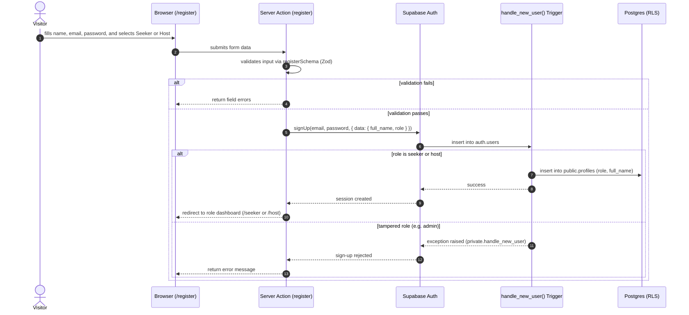
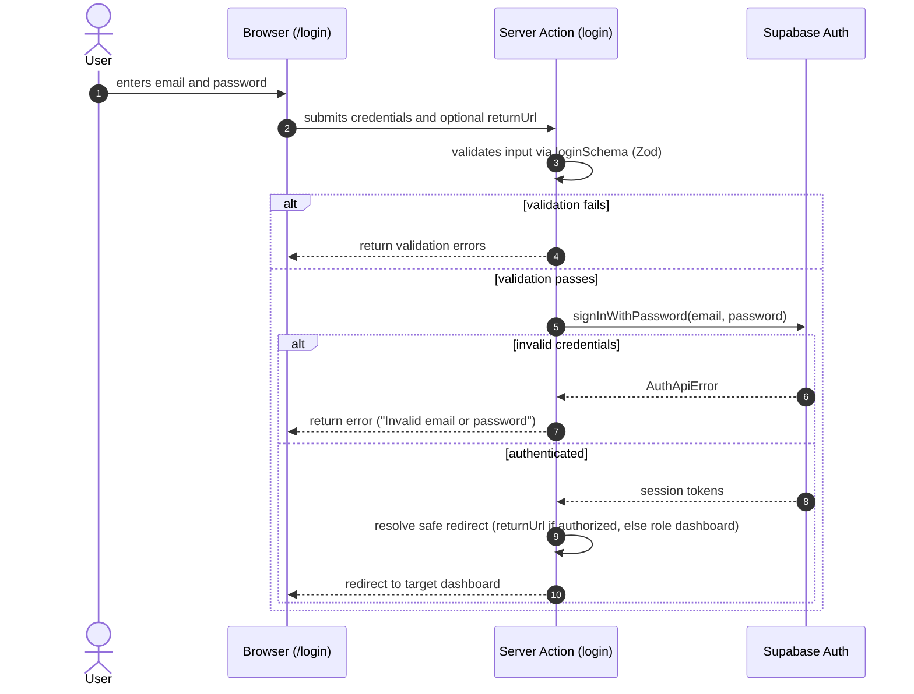
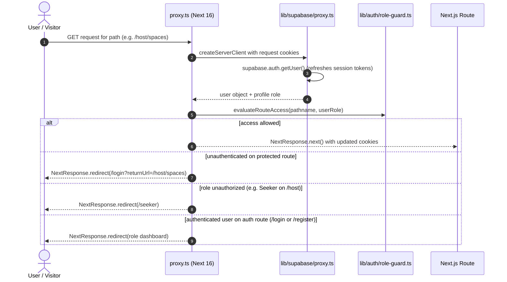

# STORY-03: Multi-role authentication and route guard

**Status:** draft · **Owner:** @lukedongque · **Story:** #52 · **FR:** SRS §3.5.1 ·
**Depends on:** STORY-01, STORY-02 · **Decisions:** D-007, D-010, D-013, D-016, D-019, D-020, D-027, D-028, D-029, D-031

## 0. Scope

**In:**

- `/login` page with email and password authentication against Supabase Auth.
- `/register` page enabling visitors to register as a **Seeker** or a **Host**.
- Shared Zod validation schemas in `lib/validation/auth.ts` executed in the browser and on the server.
- Password complexity validation: minimum 8 characters, at least one digit, and at least one special character/symbol.
- Next 16 `proxy.ts` (root) and `lib/supabase/proxy.ts` for session cookie refresh on every request.
- Pure route-guard logic in `lib/auth/role-guard.ts` with colocated Vitest tests.
- Role-based redirect rules:
  - Unauthenticated visitors accessing protected dashboards (`/seeker/*`, `/host/*`, `/admin/*`) are redirected to `/login?returnUrl=...`.
  - Authenticated Seekers attempting to access `/host/*` or `/admin/*` are redirected to `/seeker`.
  - Authenticated Hosts attempting to access `/seeker/*` or `/admin/*` are redirected to `/host`.
  - Authenticated Administrators can access `/admin/*`, `/seeker/*`, and `/host/*` (settling the Sprint 1 question: Administrators can audit all portals).
  - Authenticated users visiting `/login` or `/register` are redirected to their respective dashboard.
- Sign-out Server Action that invalidates the session and redirects to the landing page.
- Auth callback route handler (`app/api/auth/callback/route.ts`) for Supabase Auth exchanges.

**Out:**

- Profile editing (`full_name`, `phone_number` mutations on `profiles`) — owned by STORY-04.
- Space management and Host portal dashboard features — owned by STORY-05.
- Administrator verification screen — owned by STORY-14.
- Database triggers, RLS policies, and migrations — already implemented in STORY-01.
- End-to-end browser journeys using Playwright — owned by STORY-06.

## 1. Flow

### Sign-up flow



### Login flow



### Route guard in Next 16 `proxy.ts`



## 2. Data and state

### Enums & Types

- `user_role`: `'seeker' | 'host' | 'admin'` (matching `Database['public']['Enums']['user_role']`).
- `register_role`: `'seeker' | 'host'` (strict subset allowed during registration).

### Validation Schemas (`lib/validation/auth.ts`)

Shared between browser client and Server Actions using Zod:

1. **`registerSchema`**:
   - `fullName`: string, trimmed, min 1 char, max 100 chars (`"Full name is required"` / `"Full name must not exceed 100 characters"`).
   - `email`: string, trimmed, lowercase, valid email format (`"Please enter a valid email address"`).
   - `role`: `z.enum(['seeker', 'host'], { errorMap: () => ({ message: 'Please select whether you are a Seeker or a Host' }) })`.
   - `password`: string, min 8 chars (`"Password must be at least 8 characters"`), max 72 chars, must contain at least one digit (`"Password must contain at least one number"`), must contain at least one symbol/special character (`"Password must contain at least one symbol"`).
   - `confirmPassword`: string.
   - Refinement: `password === confirmPassword` (`"Passwords do not match"`).

2. **`loginSchema`**:
   - `email`: string, trimmed, lowercase, valid email format.
   - `password`: string, min 1 char (`"Password is required"`).
   - `returnUrl`: optional string, validated by `sanitizeReturnUrl` (must begin with `/` and not `//` to eliminate open-redirect vulnerabilities).

### Route Access Matrix (`lib/auth/role-guard.ts`)

| Route Category    | Paths                               | Anonymous                     | `seeker`           | `host`           | `admin`           |
| ----------------- | ----------------------------------- | ----------------------------- | ------------------ | ---------------- | ----------------- |
| **Public**        | `/`, `/about`, `/contact`, `/terms` | Allow                         | Allow              | Allow            | Allow             |
| **Auth**          | `/login`, `/register`               | Allow                         | Redirect `/seeker` | Redirect `/host` | Redirect `/admin` |
| **Seeker Portal** | `/seeker`, `/seeker/*`              | Redirect `/login?returnUrl=…` | Allow              | Redirect `/host` | Allow             |
| **Host Portal**   | `/host`, `/host/*`                  | Redirect `/login?returnUrl=…` | Redirect `/seeker` | Allow            | Allow             |
| **Admin Portal**  | `/admin`, `/admin/*`                | Redirect `/login?returnUrl=…` | Redirect `/seeker` | Redirect `/host` | Allow             |
| **System**        | `/api/auth/callback`                | Allow                         | Allow              | Allow            | Allow             |

**Decision on Administrator Access (D-031, Settling Sprint 1 Question):**  
Administrators have access to `/admin`, `/seeker`, and `/host` (D-031). This allows platform administrators to audit seeker venue search/reservation experiences and inspect host space management portals as required by moderation and administrative oversight (SRS §3.1.5, FR-5.1, FR-5.2), matching STORY-06 test assumptions.

## 3. UI and files

```
app/
  (auth)/
    login/
      page.tsx                 Server Component: page shell, meta, returnUrl extraction
      _components/
        login-form.tsx         Client Component: form state, client Zod validation, error banners
    register/
      page.tsx                 Server Component: page shell, meta
      _components/
        register-form.tsx      Client Component: role selector (Seeker/Host), password strength hints
    actions.ts                 Server Actions: login, register, signOut
  api/
    auth/
      callback/
        route.ts               Route Handler: exchange auth code for session tokens (D-010)
proxy.ts                       Next 16 proxy convention at project root
lib/
  supabase/
    proxy.ts                   Supabase client adapter for Next 16 Proxy (cookie get/set on NextResponse)
  auth/
    role-guard.ts              Pure route authorization decision function: evaluateRouteAccess()
    role-guard.test.ts         Vitest unit tests for role guard matrix and returnUrl sanitization
  validation/
    auth.ts                    Zod schemas: loginSchema, registerSchema, sanitizeReturnUrl
    auth.test.ts               Vitest unit tests for validation rules (boundary and regex tests)
```

### Accessibility (WCAG 2.1 AA)

- All inputs, buttons, and clickable controls have a minimum touch target size of 48×48 px (`min-h-[48px]`, `min-w-[48px]`).
- Every form field is explicitly associated with a `<Label htmlFor="...">`.
- Inline field errors use `aria-describedby` linked to error message IDs, with `aria-invalid="true"` set upon error.
- Interactive elements provide clear focus rings using `focus-visible:ring-2 focus-visible:ring-offset-2`.
- Contrast ratio between text and background exceeds 4.5:1 for normal text and 3:1 for large text / controls.
- Keyboard navigation: Full sequential navigation via Tab, Shift+Tab, and activation via Enter/Space.
- Fully responsive across mobile (360px), tablet (768px), and desktop (1024px) without horizontal scrolling.

## 4. Security and test matrix

| Layer                             | Case                                                                     | Expected                                                           |
| --------------------------------- | ------------------------------------------------------------------------ | ------------------------------------------------------------------ |
| **Vitest** (`auth.test.ts`)       | Valid email and compliant password (e.g. `Password123!`)                 | Passes validation                                                  |
| **Vitest** (`auth.test.ts`)       | Password < 8 characters, or missing number, or missing symbol            | Fails with specific error message                                  |
| **Vitest** (`auth.test.ts`)       | Registration with role `admin` or invalid string                         | Fails Zod enum validation                                          |
| **Vitest** (`auth.test.ts`)       | Mismatched password and confirmPassword                                  | Fails refinement validation                                        |
| **Vitest** (`role-guard.test.ts`) | Anonymous visitor requests `/seeker` or `/host/spaces`                   | Redirects to `/login?returnUrl=...`                                |
| **Vitest** (`role-guard.test.ts`) | `seeker` requests `/host` or `/admin`                                    | Redirects to `/seeker`                                             |
| **Vitest** (`role-guard.test.ts`) | `host` requests `/seeker` or `/admin`                                    | Redirects to `/host`                                               |
| **Vitest** (`role-guard.test.ts`) | `admin` requests `/admin`, `/seeker`, or `/host`                         | Access allowed for all portals                                     |
| **Vitest** (`role-guard.test.ts`) | Signed-in user requests `/login` or `/register`                          | Redirects to user's dashboard                                      |
| **Vitest** (`role-guard.test.ts`) | Malicious `returnUrl` (e.g. `//evil.com`, `https://evil.com`)            | Sanitized to role dashboard (no open redirect)                     |
| **Manual**                        | Sign up new Seeker (`test-seeker@example.test`)                          | Profile created with role `seeker`; redirected to `/seeker`        |
| **Manual**                        | Sign up new Host (`test-host@example.test`)                              | Profile created with role `host`; redirected to `/host`            |
| **Manual**                        | Tampered sign-up request attempting `role: "admin"` in user metadata     | Database trigger `private.handle_new_user()` aborts with exception |
| **Manual**                        | Log in with seeded accounts (`seeker@example.test`, `host@example.test`) | Redirected to `/seeker` and `/host` respectively                   |
| **Manual**                        | Click sign-out button                                                    | Session cookie cleared; redirected to `/`                          |

## 5. Tasks and estimates

These rows become the story's TSK sub-issues once this doc is merged:

| Task     | What                                                                       | Owner        | Points (1–10) | Days | Depends on                             |
| -------- | -------------------------------------------------------------------------- | ------------ | ------------- | ---- | -------------------------------------- |
| TSK-03.1 | Shared Zod validation schemas (`lib/validation/auth.ts`) and unit tests    | @lukedongque | 2             | 0.5  | None                                   |
| TSK-03.2 | Pure role-guard logic (`lib/auth/role-guard.ts`) and unit tests            | @lukedongque | 2             | 0.5  | None                                   |
| TSK-03.3 | Next 16 `proxy.ts` and `lib/supabase/proxy.ts` session refresh & redirects | @lukedongque | 3             | 1.0  | TSK-03.2, STORY-01                     |
| TSK-03.4 | `/login` and `/register` pages, forms, Server Actions, and auth callback   | @lukedongque | 5             | 1.0  | TSK-03.1, TSK-03.3, STORY-01, STORY-02 |

## 6. Build order

One PR per row, and every PR targets `main`:

| #   | Branch                        | PR title                                                           | Contains                                                           |
| --- | ----------------------------- | ------------------------------------------------------------------ | ------------------------------------------------------------------ |
| 1   | `feature/STORY-03-validation` | `feat(STORY-03): add auth validation schemas and tests`            | `lib/validation/auth.ts`, `lib/validation/auth.test.ts` (TSK-03.1) |
| 2   | `feature/STORY-03-role-guard` | `feat(STORY-03): add role guard evaluation logic and tests`        | `lib/auth/role-guard.ts`, `lib/auth/role-guard.test.ts` (TSK-03.2) |
| 3   | `feature/STORY-03-next-proxy` | `feat(STORY-03): add next 16 proxy and supabase session refresh`   | `proxy.ts`, `lib/supabase/proxy.ts` (TSK-03.3)                     |
| 4   | `feature/STORY-03-auth-pages` | `feat(STORY-03): add login and register pages with server actions` | `app/(auth)/**`, `app/api/auth/callback/**` (TSK-03.4)             |

## 7. Rejected alternatives

- **Client-only auth guard with `useEffect`:** Rejected because it causes visible content flashes of protected pages, delays redirection, and impairs UX. Next 16 `proxy.ts` runs ahead of page rendering.
- **Full database lookup on every static asset/sub-resource in `proxy.ts`:** Rejected to avoid high latency and database load. The proxy relies on the JWT payload and cached profile metadata refreshed via `getUser()`, while Postgres Row-Level Security remains the ultimate, authoritative security boundary for data access (D-007).
- **Single combined auth modal:** Rejected because dedicated routes (`/login`, `/register`) support bookmarking, deep-linking, predictable `returnUrl` handling, and better mobile accessibility.
- **Admin registration option on the public form:** Rejected because administrator accounts must never be publicly self-registered (D-013, STORY-01).

## 8. Open questions

- None. (The Sprint 1 question regarding Administrator portal access has been settled: Administrators are granted access to `/admin`, `/seeker`, and `/host` to facilitate platform inspection and moderation).

## 9. After the build

_(To be filled when the story is implemented)_

- what turned out different from this plan, and why:
- status line changed to `implemented YYYY-MM-DD`:
- docs this story changed:
- who verified each acceptance criterion:
