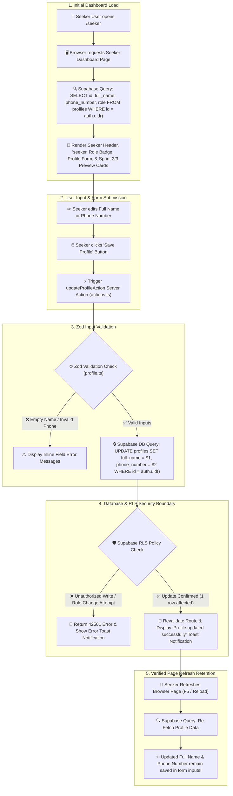

# STORY-04: Seeker portal and user profile CRUD

**Status:** draft · **Owner:** @JamesNino-Mandawe · **Story:** #53 · **FR:** SRS §3.4.1, §3.8, FR-4.1 ·
**Depends on:** STORY-01, STORY-02, STORY-03 · **Decisions:** D-007, D-011, D-015, D-016, D-019, D-027

## 0. Scope

**In:**

- Seeker Dashboard Layout (`app/(dashboard)/seeker/layout.tsx`): protected dashboard route, header with user full name, `"seeker"` role badge, and Logout button trigger.
- Profile View & Edit Form (`app/(dashboard)/seeker/page.tsx`): pre-populated form allowing signed-in Seekers to view and update their `full_name` (1–100 chars) and `phone_number` (max 20 chars).
- Server Action Mutation (`app/(dashboard)/seeker/actions.ts`): `updateProfileAction()` processing form submissions and updating `public.profiles` via Supabase client.
- Zod Validation Schema (`lib/validation/profile.ts`): shared validation rules enforced in browser and on server.
- Sprint 2 & 3 Information Preview Cards: accessible info cards displaying previews of upcoming search and reservation features.
- Unit & Verification Tests (`lib/validation/profile.test.ts`): Vitest suite validating schema rules and handling field error assertions.

**Out:**

- Study preferences, avatar image uploads, and amenity tags (deferred to STORY-08 per D-027).
- Authentication route endpoints `/login` and `/register` (built by STORY-03).
- Host space listing CRUD (built by STORY-05).

## 1. Flow

## 2. Data and state

- **Tables and columns:** Modifies `public.profiles` (`full_name text`, `phone_number text`, `updated_at timestamptz`). Primary key `id` and column `role` remain immutable by the user (D-027).
- **Zod schemas in `lib/validation/profile.ts`:**
  - `full_name`: string, required, trimmed, 1–100 characters.
  - `phone_number`: optional string, trimmed, max 20 characters, regex `/^[0-9+\-\s()]*$/`.
- **RLS policies and GRANTs:**
  - `profiles` SELECT: authenticated user reads their own row (`id = auth.uid()`).
  - `profiles` UPDATE: authenticated user updates `full_name` and `phone_number` on their own row (`id = auth.uid()`).
  - Column grants for `UPDATE`: restricted to `full_name` and `phone_number`. Modifying `role` or `id` is refused with `42501`.

## 3. UI and files

- **Routes and components:**
  - `app/(dashboard)/seeker/layout.tsx`: Server Component providing protected dashboard shell and layout container.
  - `components/seeker-header.tsx`: Server Component rendering avatar, Seeker name, role badge (`"seeker"`), and Logout trigger.
  - `app/(dashboard)/seeker/page.tsx`: Server Component fetching profile data and rendering Client Component form.
  - `app/(dashboard)/seeker/_components/profile-form.tsx`: Client Component form with reactive error feedback and toast triggers.
  - `app/(dashboard)/seeker/actions.ts`: Server Action executing `updateProfileAction()`.
  - `lib/validation/profile.ts`: Shared Zod validation schema.
- **Accessibility (WCAG 2.1 AA):**
  - Minimum touch target size $\ge 48\text{px} \times 48\text{px}$ for all buttons and inputs.
  - Visible focus indicators (`ring-2 ring-primary`) on keyboard navigation (`Tab`, `Shift+Tab`, `Enter`).
  - High contrast ratio $\ge 4.5:1$ for body text against backgrounds.
  - Responsive layouts without horizontal scrolling at 360px, 768px, and 1024px.

## 4. Security and test matrix

| Layer  | Case                                                                 | Expected                                              |
| :----- | :------------------------------------------------------------------- | :---------------------------------------------------- |
| Vitest | Valid `full_name` and valid `phone_number`                           | Validation succeeds                                   |
| Vitest | Empty or whitespace-only `full_name`                                 | Validation fails with _"Full name is required"_       |
| Vitest | `phone_number` exceeding 20 characters or containing invalid symbols | Validation fails with _"Invalid phone number format"_ |
| pgTAP  | Seeker reads their own profile row                                   | Returns 1 row                                         |
| pgTAP  | Seeker attempts to update another user's profile row                 | 0 rows affected, write rejected (`42501`)             |
| pgTAP  | Seeker attempts to update their own `role` or `id`                   | Write refused (`42501`)                               |
| Manual | Seeker updates profile, refreshes browser (F5)                       | Updated details persist cleanly                       |

## 5. Tasks and estimates

| Task     | What                                                                                                                           | Owner | Points (1–10) | Days | Depends on         |
| :------- | :----------------------------------------------------------------------------------------------------------------------------- | :---- | :------------ | :--- | :----------------- |
| TSK-04.1 | Create Zod validation schema `lib/validation/profile.ts` and Vitest suite `profile.test.ts`                                    | James | 2             | 0.5  | —                  |
| TSK-04.2 | Create Seeker dashboard layout `app/(dashboard)/seeker/layout.tsx` and header `components/seeker-header.tsx`                   | James | 3             | 0.5  | STORY-02           |
| TSK-04.3 | Create Profile Edit form `app/(dashboard)/seeker/_components/profile-form.tsx` and page view `app/(dashboard)/seeker/page.tsx` | James | 3             | 0.5  | TSK-04.2           |
| TSK-04.4 | Create Server Action `app/(dashboard)/seeker/actions.ts` and wire form submission to Supabase `profiles` table                 | James | 4             | 0.5  | TSK-04.1, STORY-01 |
| TSK-04.5 | Build Sprint 2 & 3 preview placeholder cards and verify WCAG 2.1 AA accessibility                                              | James | 2             | 0.5  | TSK-04.3           |

## 6. Build order

Every PR targets `main`.

| #   | Branch                                 | PR title                                                              | Contains                 |
| :-- | :------------------------------------- | :-------------------------------------------------------------------- | :----------------------- |
| 1   | `feature/STORY-04-design`              | `docs(STORY-04): design seeker profile crud`                          | Design specification doc |
| 2   | `feature/STORY-04-seeker-profile-crud` | `feat(STORY-04): build seeker validation schema and unit tests`       | TSK-04.1                 |
| 3   | `feature/STORY-04-seeker-profile-crud` | `feat(STORY-04): build seeker dashboard layout and page shell`        | TSK-04.2, TSK-04.3       |
| 4   | `feature/STORY-04-seeker-profile-crud` | `feat(STORY-04): wire profile update server action and preview cards` | TSK-04.4, TSK-04.5       |

## 7. Rejected alternatives

- **Including study preferences in Sprint 1:** Rejected per Decision D-027. Preferences require curated tag structures that arrive in Sprint 2 (STORY-08).
- **Avatar image file upload in Sprint 1:** Rejected as Supabase Storage integration is scheduled for Sprint 2.
- **REST endpoint for profile updates:** Rejected per Decision D-010 in favor of Server Actions (`actions.ts`).

## 8. Open questions

None. Scope, fields, and security boundaries are fully settled per Decisions D-007, D-010, D-016, and D-027.

## 9. After the build

_(To be filled when STORY-04 is completed)_
