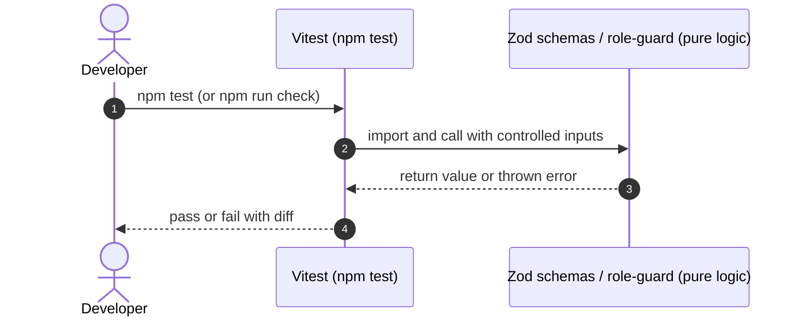
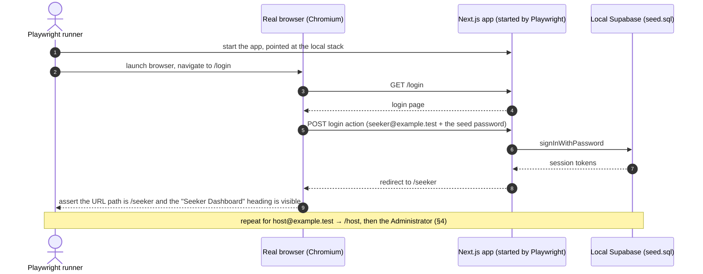

# STORY-06: Automated tests and QA verification

**Status:** implemented 2026-10-04 · **Owner:** @lukedongque · **Story:** #55 · **FR:** SRS §3.5.1 ·
**Depends on:** STORY-03, STORY-04 and STORY-05 (all merged) · **Decisions:** D-013, D-014,
D-027, D-028, D-032

## 0. Scope

**In:**

- Vitest unit tests for the auth validation schemas (`lib/validation/auth.ts`) and the
  role guard (`lib/auth/role-guard.ts`). These tests shipped with STORY-03 and are
  merged; this story audits and owns them.
- Vitest unit tests for the Seeker profile schema (`lib/validation/profile.ts`), shipped
  with STORY-04.
- A check that the Space form schema's tests, which STORY-05 shipped in
  `lib/validation/space.test.ts` (TSK-05.1, #133), cover the required fields. This story
  writes no second test file for that schema.
- A Playwright smoke test that opens a real browser, signs in as each seeded account
  (`seeker@example.test`, `host@example.test`, and `admin@example.test` on the local
  stack and in CI only), and asserts that each one lands on the right page.
- A new `e2e` job in `.github/workflows/ci.yml` that runs the smoke test on every pull
  request, next to `checks` and `db`, without being a required check in Sprint 1.

**Out:**

- Sprint 2 and Sprint 3 journey tests.
- pgTAP database policy tests, owned by STORY-01 and STORY-05.
- Any new validation logic, owned by the story that introduces the form.
- Making `e2e` a required check. That is a ruleset change only Adrian makes (D-014).

## 1. Flow

This story has no user-facing flow. The two test layers run independently.

### Vitest unit tests



No database, no browser, no network: pure in-process logic only.

### Playwright smoke test



The Playwright test runs only against the local Supabase stack (`npm run db:start`, which
applies the migrations and `supabase/seed.sql`), never the shared cloud project.
Playwright starts its own copy of the app on its own port, with
`NEXT_PUBLIC_SUPABASE_URL` and `NEXT_PUBLIC_SUPABASE_PUBLISHABLE_KEY` set to the local
stack's values (`npx supabase status -o env`). Next.js reads `process.env` before
`.env.local`, and fixes `NEXT_PUBLIC_` values when it builds, so they are set for both
the build and the server. Playwright never reuses a running dev server: a teammate's
`npm run dev` usually points at the cloud project through `.env.local`, where the seed
password doesn't work and automated sign-ins don't belong (D-028).

## 2. Data and state

No tables, columns, enums or RLS policies change. No Zod schemas are added here; STORY-06
only tests what other stories own.

### Existing code under test

| File                        | Exported symbols                                        | Tests                | Owner story |
| --------------------------- | ------------------------------------------------------- | -------------------- | ----------- |
| `lib/validation/auth.ts`    | `loginSchema`, `registerSchema`, `sanitizeReturnUrl`    | `auth.test.ts`       | STORY-03    |
| `lib/auth/role-guard.ts`    | `evaluateRouteAccess`, `dashboardFor`, `landingPathFor` | `role-guard.test.ts` | STORY-03    |
| `lib/validation/profile.ts` | `profileUpdateSchema`                                   | `profile.test.ts`    | STORY-04    |
| `lib/validation/space.ts`   | `spaceSchema`, `spaceIdSchema`                          | `space.test.ts`      | STORY-05    |

### Seeded test accounts

All three come from `supabase/seed.sql` and share the seed's password, which is written
in that file and public by design (D-013). The smoke test runs only where these accounts
exist: the local stack and CI. It never uses `CLOUD_DEV_ACCOUNT_PASSWORD`, which exists
only on the cloud project (D-028).

| Email                 | Role   | Where it exists                                          |
| --------------------- | ------ | -------------------------------------------------------- |
| `seeker@example.test` | seeker | Local stack and CI (`supabase/seed.sql`)                 |
| `host@example.test`   | host   | Local stack and CI (`supabase/seed.sql`)                 |
| `admin@example.test`  | admin  | Local stack and CI only, never the cloud project (D-013) |

## 3. UI and files

No new routes or UI components.

**TSK-06.1 (the smoke test) adds or changes:**

```
e2e/
  smoke.spec.ts             Playwright: sign in as each seeded account; assert where it lands
playwright.config.ts        Chromium, its own port, starts the app against the local stack
package.json                @playwright/test in devDependencies; a `test:e2e` script (`playwright test`)
package-lock.json           the lockfile update
AGENTS.md                   the Commands block gains `npm run test:e2e`; the "On main today" note gains `e2e/`
docs/DEVELOPMENT.md         how to run the smoke test locally: the stack running, Chromium installed
docs/guides/testing.md      the Journey row: `e2e/` exists, and how to run it
```

**TSK-06.3 (the CI job) changes:**

```
.github/workflows/ci.yml                 a new `e2e` job next to `checks` and `db`
docs/guides/working-with-git-and-prs.md  the CI table gains `e2e`, marked not required
```

**Already in place, owned by this story going forward:**

```
lib/
  validation/
    auth.test.ts            Vitest: loginSchema, registerSchema, sanitizeReturnUrl (STORY-03)
    profile.test.ts         Vitest: profileUpdateSchema (STORY-04)
  auth/
    role-guard.test.ts      Vitest: evaluateRouteAccess, dashboardFor, landingPathFor (STORY-03)
```

`lib/validation/space.test.ts` stays STORY-05's (TSK-05.1); TSK-06.2 only checks it.

Two things need no change: Vitest only includes `lib/**/*.test.ts`, so it won't pick up
`e2e/*.spec.ts`, and `.gitignore` already ignores `test-results/` and
`playwright-report/`.

## 4. Security and test matrix

### Vitest: auth schemas (`auth.test.ts`, already merged)

| Case                                                         | Expected                                                      |
| ------------------------------------------------------------ | ------------------------------------------------------------- |
| Valid email and compliant password (`Password123!`)          | `loginSchema` passes                                          |
| Invalid email format                                         | Fails with "Please enter a valid email address"               |
| Empty password on login                                      | Fails with "Password is required"                             |
| Password shorter than 8 characters                           | Fails with "Password must be at least 8 characters"           |
| Password exactly 72 characters                               | Passes                                                        |
| Password 73 characters                                       | Fails with "Password must be 72 characters or fewer"          |
| Password without a digit                                     | Fails with "Password must contain at least one number"        |
| Password without a symbol                                    | Fails with "Password must contain at least one symbol"        |
| Passwords do not match                                       | Fails with "Passwords do not match"                           |
| Role `admin` on register                                     | Fails with "Please select whether you are a Seeker or a Host" |
| Role invalid string                                          | Fails Zod enum validation                                     |
| Safe `returnUrl` (e.g. `/host/spaces`)                       | Kept as-is                                                    |
| Unsafe `returnUrl` (`//evil.com`, `/.//evil.com`, backslash) | Dropped: `sanitizeReturnUrl` returns the default path instead |

### Vitest: role guard (`role-guard.test.ts`, already merged)

| User               | Path                         | Expected                         |
| ------------------ | ---------------------------- | -------------------------------- |
| Anonymous          | `/seeker`, `/host`, `/admin` | Redirect to `/login?returnUrl=…` |
| Anonymous          | `/`, `/login`, `/register`   | Allow                            |
| `seeker`           | `/seeker`, `/seeker/profile` | Allow                            |
| `seeker`           | `/host`, `/admin`            | Redirect to `/seeker`            |
| `host`             | `/host`, `/host/spaces`      | Allow                            |
| `host`             | `/seeker`, `/admin`          | Redirect to `/host`              |
| `admin`            | `/admin`, `/seeker`, `/host` | Allow (D-032)                    |
| Any signed-in role | `/login`, `/register`        | Redirect to role dashboard       |
| Any role           | `/seekers`, `/hostel`        | Allow (not a portal prefix)      |

### Vitest: Space schema (`space.test.ts`, owned by STORY-05)

STORY-05 owns these tests (STORY-05 design §4.3, TSK-05.1, #133). TSK-06.2 checks that
they guard the required fields, using the sprint brief's method: break one rule on
purpose, watch the test go red, then put it back.

| Rule to remove for a moment in `lib/validation/space.ts` | Expected                            |
| -------------------------------------------------------- | ----------------------------------- |
| The required check (`min(1)`) on `name`                  | `npm test` fails in `space.test.ts` |
| The required check on `address`                          | `npm test` fails in `space.test.ts` |
| The required check on `opensAt`                          | `npm test` fails in `space.test.ts` |
| The required check on `closesAt`                         | `npm test` fails in `space.test.ts` |

The schema deliberately has no rule that closing comes after opening: an earlier closing
time means the Space closes after midnight, and equal times mean it is open 24 hours
(D-027). No test in this story may expect otherwise.

### Playwright: smoke test (`smoke.spec.ts`)

| Scenario                                                                          | Assertion                                                                          |
| --------------------------------------------------------------------------------- | ---------------------------------------------------------------------------------- |
| Sign in at `/login` as `seeker@example.test`                                      | The URL path is `/seeker`, and the "Seeker Dashboard" heading is visible           |
| Sign in at `/login` as `host@example.test`                                        | The URL path is `/host`, and the "Manage Spaces" heading is visible                |
| Sign in at `/login?returnUrl=%2Fhost` as `admin@example.test` (local and CI only) | The URL path is `/host`, and the header's role badge reads "Administrator" (D-032) |
| As that Administrator, open `/seeker`                                             | The page opens, and the badge reads "Administrator"                                |

The Administrator signs in from `/login?returnUrl=%2Fhost` because there is no `/admin`
page until STORY-14: a plain sign-in would land on a 404, which proves nothing. Every
assertion uses the URL path, visible text or roles, never CSS classes.

### Manual checks

| Step                                                                        | Expected                                                   |
| --------------------------------------------------------------------------- | ---------------------------------------------------------- |
| `npm test` on `main` with no local changes                                  | All Vitest tests green                                     |
| `npm run check`                                                             | TypeScript, ESLint, Prettier and Vitest all pass           |
| `npm run test:e2e` with the local stack running                             | The smoke test passes for all three accounts               |
| Break one assertion on purpose (for example, expect `/host` for the Seeker) | The smoke test goes red; put it back and it is green again |
| TSK-06.2's four temporary breaks in `space.ts`                              | `npm test` goes red each time, and green once restored     |

## 5. Tasks and estimates

These rows become the story's TSK sub-issues once this doc is merged.

| Task     | What                                                                                                                                                                                                            | Owner        | Points (1–10) | Days | Depends on                                                          |
| -------- | --------------------------------------------------------------------------------------------------------------------------------------------------------------------------------------------------------------- | ------------ | ------------- | ---- | ------------------------------------------------------------------- |
| TSK-06.1 | Add Playwright and the smoke test: `@playwright/test`, `playwright.config.ts`, `e2e/smoke.spec.ts` for the Seeker, the Host and the Administrator, the `test:e2e` script and the §3 doc updates; verify locally | @lukedongque | 3             | 0.5  | STORY-03, STORY-04 and STORY-05 merged (done); local Supabase stack |
| TSK-06.2 | Check that STORY-05's `space.test.ts` covers the required fields: break each rule in §4 once, watch the test go red, restore it, and record the result on #55                                                   | @lukedongque | 1             | 0.25 | STORY-05 merged (done)                                              |
| TSK-06.3 | Add the `e2e` job to `.github/workflows/ci.yml`, as the CI decision below describes                                                                                                                             | @lukedongque | 2             | 0.5  | TSK-06.1 merged                                                     |

**TSK-06.1 and TSK-06.2 can start at once; TSK-06.3 follows TSK-06.1.**

### CI decision (settled here)

The smoke test runs in CI as a new job named `e2e` in `.github/workflows/ci.yml` (the
`CI` workflow), next to `checks` and `db`. It:

- starts the local Supabase stack with `npx supabase start`, like `db` does, but keeps
  Kong, PostgREST and Auth, which the app needs and `db` leaves out; the seeded accounts
  come from `supabase/seed.sql`;
- installs Chromium (`npx playwright install --with-deps chromium`);
- points the app at the local stack with the values from `npx supabase status -o env`;
  and
- runs `npm run test:e2e`.

It is not a required check in Sprint 1, so a flaky browser test can't block a teammate's
merge. Making it required later is a ruleset change only Adrian makes (D-014). Its name
must not reuse `checks`, `pr-title` or `db`: those names are a contract (AGENTS.md).

The Administrator case runs locally and in this job only, because the cloud project has
no Administrator (D-013).

## 6. Build order

One PR per row. Every PR targets `main`, and none is stacked.

| #   | Branch                        | PR title                                              | Contains                                                                                                                                                 |
| --- | ----------------------------- | ----------------------------------------------------- | -------------------------------------------------------------------------------------------------------------------------------------------------------- |
| 1   | `feature/STORY-06-playwright` | `test(STORY-06): add a Playwright sign-in smoke test` | TSK-06.1: `playwright.config.ts`, `e2e/smoke.spec.ts`, `package.json`, `package-lock.json`, `AGENTS.md`, `docs/DEVELOPMENT.md`, `docs/guides/testing.md` |
| 2   | `feature/STORY-06-e2e-ci`     | `ci(STORY-06): run the smoke test in CI`              | TSK-06.3: `.github/workflows/ci.yml`, `docs/guides/working-with-git-and-prs.md`                                                                          |

PR 2 opens after PR 1 merges. TSK-06.2 changes no code, so it has no PR: its result goes
on #55 and in §9.

## 7. Rejected alternatives

- **Running Playwright against the cloud database:** Rejected. Automated sign-ins would
  exhaust rate limits and pollute shared data, and the cloud accounts use a private
  password the tests must not hold. The local stack with `seed.sql` is reproducible and
  isolated (D-013, D-028).
- **Reusing a running dev server:** Rejected. A teammate's `npm run dev` usually points
  at the cloud project through `.env.local`, so the test would sign in there.
- **A second test file for the Space schema:** Rejected. STORY-05's TSK-05.1 already
  owns `space.test.ts`, and a copy would drift from it. An earlier draft of this plan
  also expected a closing-time rule that D-027 rules out.
- **Asserting that the Administrator lands on `/admin`:** Rejected. There is no `/admin`
  page until STORY-14, so the assertion would pass on a 404.
- **Putting the Playwright setup and the CI job in one PR:** Rejected. The CI job can only
  be judged once the test passes locally, and two small PRs are easier to review.
- **Skipping Playwright entirely in CI:** Considered. A Playwright test that only runs
  locally is frequently skipped and quickly rots. A non-required CI job gives feedback
  without gating merges, so it is kept.

## 8. Open questions

None. The CI decision is made in §5.

## 9. After the build

Built in two PRs, in the §6 order: #157 (TSK-06.1, the Playwright smoke test) and #160
(TSK-06.3, the CI job). TSK-06.2 changed no code, as planned: Luke recorded its result on
#55 on 1 Oct, and Adrian's agent re-ran it on `main` (#150). Adrian's agent reviewed both
PRs and, on Adrian's instruction, pushed the trace upload and the job timeout to #160
(`aa53f6d`). Luke reviews that commit to be ready to explain it in the Final phase.

**Different from the plan:**

- `playwright.config.ts` reads the local stack's URL and publishable key from
  `npx supabase status -o env` itself (§1), so the `e2e` job sets no values. The first
  draft fell back to a stand-in key, which still signs in on the local stack but makes any
  read before sign-in fail; the review of #157 changed it.
- The Administrator's badge is checked inside the header (the `banner` landmark) for the
  exact word. The Host portal also says "an Administrator verifies it" twice, so a
  page-wide text search found three matches (#157).
- The app runs at `http://localhost:3100`, not `127.0.0.1`: Next 16 blocks its dev
  resources, such as the HMR socket, for other host names (#157).
- `npm run test:e2e` can't run beside `npm run dev`, because Next 16 runs one dev server
  per project folder. The run steps say to stop it first (#157).
- When the `e2e` job fails, it uploads `test-results/`, where Playwright keeps the trace of
  its retry, as the `playwright-traces` artifact. The job stops after 20 minutes (#160).

**Still open:** nothing for this story. The `e2e` job stays a check that isn't required
(§5); making it required is a ruleset change only Adrian makes (D-014).

**Docs this story changed:** `AGENTS.md` (the Commands block and the layout note),
`docs/DEVELOPMENT.md` (the Tools table and how to run the smoke test),
`docs/guides/testing.md` (the Journey row and section) and
`docs/guides/working-with-git-and-prs.md` (the CI table), in #157 and #160; the design
index and the Sprint 1 brief at the close-out.

**Final checks:** `npm run check` (128/128 tests) and `npm run build` pass on `main` at
`ddcd608`, and so do CI's `checks`, `db` and `e2e` jobs there, with the smoke test at 3/3
in Chromium.

**Acceptance criteria (#55):** checked by Adrian's agent (Claude Code) on the local
Supabase stack and in CI. Nothing was written to the shared cloud database.

| Criterion                                                                                                        | How it was verified                                                                                                                                                                                                                                                                                                                                                                                |
| ---------------------------------------------------------------------------------------------------------------- | -------------------------------------------------------------------------------------------------------------------------------------------------------------------------------------------------------------------------------------------------------------------------------------------------------------------------------------------------------------------------------------------------- |
| Vitest covers the auth schemas (valid email, weak passwords, role values) and the space schema (required fields) | `lib/validation/auth.test.ts` (#106) covers a valid and an invalid email; passwords that are too short, too long, or without a number or a symbol; and the `seeker`, `host`, `admin` and invalid roles. For `space.test.ts` (#133), TSK-06.2 removed each required rule (name, address, opening and closing time) and the tests went red: Luke on 1 Oct, and Adrian's agent again on `main` (#150) |
| Role-guard tests cover anonymous, seeker, host and admin users for `/seeker`, `/host` and `/admin`               | `lib/auth/role-guard.test.ts` (TSK-03.2) has a block for each of the four, on each portal                                                                                                                                                                                                                                                                                                          |
| `npm run check` is green locally and in CI                                                                       | Locally on `main` at `ddcd608` (128/128), and in CI's `checks` job on every pull request and on `main`                                                                                                                                                                                                                                                                                             |
| A Playwright smoke test signs in as each seeded role                                                             | `e2e/smoke.spec.ts` (#157): 3 passed against the local stack in the review of #157, where breaking an assertion on purpose turned it red; and in CI's `e2e` job on #160 and on `main`                                                                                                                                                                                                              |
