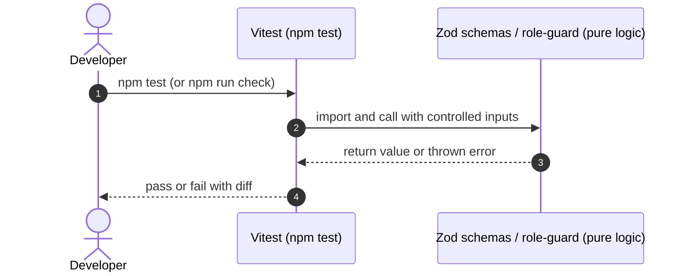
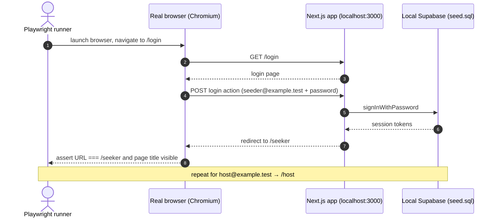

# STORY-06: Automated tests and QA verification

**Status:** draft · **Owner:** @lukedongque · **Story:** #55 · **FR:** SRS §3.5.1 ·
**Depends on:** STORY-03, STORY-05 · **Decisions:** D-007, D-013, D-028, D-032

## 0. Scope

**In:**

- Vitest unit tests for the auth validation schemas (`lib/validation/auth.ts`) and the
  role guard (`lib/auth/role-guard.ts`). These tests ship with STORY-03 and are already
  merged; this story audits and owns them.
- Vitest unit tests for the Seeker profile schema (`lib/validation/profile.ts`), shipped
  with STORY-04.
- Vitest unit tests for the space form schema (`lib/validation/spaces.ts`) — added in
  this story once STORY-05 merges that file.
- A Playwright smoke test that opens a real browser, signs in as each seeded role
  (`seeker@example.test`, `host@example.test`), and asserts the correct dashboard
  is shown.
- CI configuration ensuring `npm run check` and the Playwright test run on every pull
  request to `main`.

**Out:**

- Sprint 2 and Sprint 3 journey tests.
- pgTAP database policy tests — owned by STORY-01 and STORY-05.
- Any new validation logic — owned by the story that introduces the form.
- An Administrator Playwright case against the cloud database — the cloud dev database
  has no Administrator account (D-013). The Administrator smoke test runs on the local
  Supabase stack or in CI only.

## 1. Flow

This story has no user-facing flow. The two test layers run independently.

### Vitest unit tests



No database, no browser, no network — pure in-process logic only.

### Playwright smoke test



The Playwright test runs against a locally seeded Supabase stack (`npm run db:start` +
`npm run db:reset`). This keeps the cloud database free from automated sign-ins (D-028).

## 2. Data and state

No tables, columns, enums or RLS policies change. No Zod schemas are added here; STORY-06
only tests what other stories own.

### Existing schemas under test

| Schema file                 | Exported symbol                                         | Owner story |
| --------------------------- | ------------------------------------------------------- | ----------- |
| `lib/validation/auth.ts`    | `loginSchema`, `registerSchema`, `sanitizeReturnUrl`    | STORY-03    |
| `lib/auth/role-guard.ts`    | `evaluateRouteAccess`, `dashboardFor`, `landingPathFor` | STORY-03    |
| `lib/validation/profile.ts` | `profileUpdateSchema`                                   | STORY-04    |
| `lib/validation/spaces.ts`  | `spaceSchema` (name TBD by STORY-05)                    | STORY-05    |

### Seeded test accounts

| Email                     | Password                     | Role   | Source                     |
| ------------------------- | ---------------------------- | ------ | -------------------------- |
| `seeker@example.test`     | `CLOUD_DEV_ACCOUNT_PASSWORD` | seeker | `supabase/seed.sql`, D-028 |
| `host@example.test`       | `CLOUD_DEV_ACCOUNT_PASSWORD` | host   | `supabase/seed.sql`, D-028 |
| _(admin — local/CI only)_ | _(seeded in seed.sql only)_  | admin  | `supabase/seed.sql`, D-013 |

## 3. UI and files

No new routes or UI components. Files added or changed:

```
lib/
  validation/
    spaces.test.ts          Vitest: space form schema (added in TSK-06.2, after STORY-05)
e2e/
  smoke.spec.ts             Playwright: sign in as seeker and host; assert dashboard
playwright.config.ts        Playwright configuration (baseURL, browser, local server)
.github/
  workflows/
    e2e.yml                 (optional) CI job running Playwright; see §5 for decision
```

Already in place from STORY-03 (owned by this story going forward):

```
lib/
  validation/
    auth.test.ts            Vitest: loginSchema, registerSchema, sanitizeReturnUrl
  auth/
    role-guard.test.ts      Vitest: evaluateRouteAccess, dashboardFor, landingPathFor
```

Already in place from STORY-04:

```
lib/
  validation/
    profile.test.ts         Vitest: profileUpdateSchema
```

## 4. Security and test matrix

### Vitest — auth schemas (`auth.test.ts`, already merged)

| Case                                                         | Expected                                                      |
| ------------------------------------------------------------ | ------------------------------------------------------------- |
| Valid email and compliant password (`Password123!`)          | `loginSchema` passes                                          |
| Invalid email format                                         | Fails with "Please enter a valid email address"               |
| Empty password on login                                      | Fails with "Password is required"                             |
| Password shorter than 8 characters                           | Fails with "Password must be at least 8 characters"           |
| Password exactly 72 characters                               | Passes                                                        |
| Password 73 characters                                       | Fails with "Password must be 72 characters or fewer"          |
| Password without a digit                                     | Fails with "Password must contain at least one number"        |
| Password without a symbol                                    | Fails with "Password must contain at least one symbol"        |
| Passwords do not match                                       | Fails with "Passwords do not match"                           |
| Role `admin` on register                                     | Fails with "Please select whether you are a Seeker or a Host" |
| Role invalid string                                          | Fails Zod enum validation                                     |
| Safe `returnUrl` (e.g. `/host/spaces`)                       | Kept as-is                                                    |
| Unsafe `returnUrl` (`//evil.com`, `/.//evil.com`, backslash) | Dropped silently; login succeeds                              |

### Vitest — role guard (`role-guard.test.ts`, already merged)

| User               | Path                         | Expected                         |
| ------------------ | ---------------------------- | -------------------------------- |
| Anonymous          | `/seeker`, `/host`, `/admin` | Redirect to `/login?returnUrl=…` |
| Anonymous          | `/`, `/login`, `/register`   | Allow                            |
| `seeker`           | `/seeker`, `/seeker/profile` | Allow                            |
| `seeker`           | `/host`, `/admin`            | Redirect to `/seeker`            |
| `host`             | `/host`, `/host/spaces`      | Allow                            |
| `host`             | `/seeker`, `/admin`          | Redirect to `/host`              |
| `admin`            | `/admin`, `/seeker`, `/host` | Allow (D-032)                    |
| Any signed-in role | `/login`, `/register`        | Redirect to role dashboard       |
| Any role           | `/seekers`, `/hostel`        | Allow (not a portal prefix)      |

### Vitest — space schema (`spaces.test.ts`, added in TSK-06.2)

| Case                                  | Expected                          |
| ------------------------------------- | --------------------------------- |
| All required fields present and valid | Passes                            |
| `name` missing or empty               | Fails with required-field message |
| `address` missing or empty            | Fails with required-field message |
| `opens_at` or `closes_at` missing     | Fails with required-field message |
| `closes_at` not after `opens_at`      | Fails with time-order message     |

_Exact field names and messages come from the STORY-05 design doc._

### Playwright — smoke test (`smoke.spec.ts`)

| Scenario                         | Assertion                                       |
| -------------------------------- | ----------------------------------------------- |
| Sign in as `seeker@example.test` | URL ends with `/seeker`; seeker heading visible |
| Sign in as `host@example.test`   | URL ends with `/host`; host heading visible     |
| Sign in as admin (local/CI only) | URL ends with `/admin`                          |

### Manual checks

| Step                                                 | Expected                                         |
| ---------------------------------------------------- | ------------------------------------------------ |
| `npm test` on `main` with no local changes           | All Vitest tests green                           |
| `npm run check`                                      | TypeScript, ESLint, Prettier and Vitest all pass |
| `npx playwright test` locally (seeded stack running) | Smoke test green for seeker and host             |

## 5. Tasks and estimates

These rows become the story's TSK sub-issues once this doc is merged.

| Task     | What                                                                                                              | Owner        | Points (1–10) | Days | Depends on                                   |
| -------- | ----------------------------------------------------------------------------------------------------------------- | ------------ | ------------- | ---- | -------------------------------------------- |
| TSK-06.1 | Install Playwright; write `smoke.spec.ts` for seeker and host sign-in; add `playwright.config.ts`; verify locally | @lukedongque | 3             | 0.5  | STORY-03 login working; local Supabase stack |
| TSK-06.2 | Write `lib/validation/spaces.test.ts` for the space Zod schema                                                    | @lukedongque | 2             | 0.5  | STORY-05 `lib/validation/spaces.ts` merged   |
| TSK-06.3 | Decide and document whether Playwright runs in CI; if yes, add `.github/workflows/e2e.yml`                        | @lukedongque | 2             | 0.5  | TSK-06.1                                     |

**TSK-06.1 first, TSK-06.2 and TSK-06.3 in parallel after.**

### CI decision (settled here, not deferred)

The Playwright test **will run in CI** as a separate optional job on the `checks`
workflow. It uses the local Supabase stack started with `supabase start` inside the
runner, seeded with `supabase/seed.sql`. This is the same approach used by `npm run
db:test`. The Administrator smoke case runs only here (D-013 — no cloud admin account).

The job is marked **non-blocking on `main`** for Sprint 1, because a flaky browser test
should not block a teammate's merge. It becomes blocking in Sprint 2 once stable.

## 6. Build order

One PR per row, every PR targets `main`.

| #   | Branch                                | PR title                                                                | Contains                                                                                  |
| --- | ------------------------------------- | ----------------------------------------------------------------------- | ----------------------------------------------------------------------------------------- |
| 1   | `feature/STORY-06-playwright`         | `feat(STORY-06): add Playwright smoke test for seeker and host sign-in` | `playwright.config.ts`, `e2e/smoke.spec.ts`, `package.json` updates (TSK-06.1 + TSK-06.3) |
| 2   | `feature/STORY-06-space-schema-tests` | `test(STORY-06): add space form schema unit tests`                      | `lib/validation/spaces.test.ts` (TSK-06.2)                                                |

PR 2 can only open after STORY-05's `lib/validation/spaces.ts` is merged.

## 7. Rejected alternatives

- **Running Playwright against the cloud database:** Rejected. Automated sign-ins would
  exhaust rate limits and pollute shared data. The local stack with `seed.sql` is
  reproducible and isolated (D-013, D-028).
- **Merging all three tasks into one PR:** Rejected. Playwright and the space schema test
  have different unblock dates. One PR per concern keeps the merge queue clear.
- **Skipping Playwright entirely in CI:** Considered. A Playwright test that only runs
  locally is frequently skipped and quickly rots. A non-blocking CI job provides feedback
  without gating merges, so it is kept.

## 8. Open questions

- None blocking. The CI decision is made in §5.

## 9. After the build

_Fill this in when the story is done._

- what turned out different from this plan, and why
- the status line changed to `implemented YYYY-MM-DD`
- the docs this story changed
- who verified each acceptance criterion
