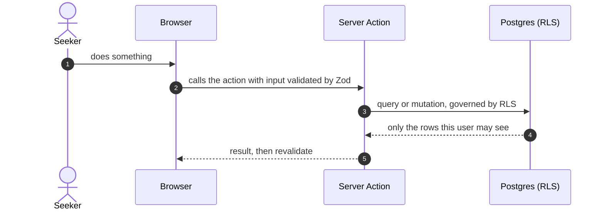

# STORY-xx: title

**Status:** draft · **Owner:** @handle · **Story:** #NN · **FR:** FR-x.y ·
**Depends on:** STORY-xx · **Decisions:** D-NNN

Copy this file to `docs/design/STORY-xx-short-desc.md`. Delete these instructions and
any section that genuinely does not apply, and say why.

## 0. Scope

**In:** what this story delivers.

**Out:** what it deliberately leaves to other stories.

## 1. Flow

A sequence diagram of the main path, across every layer involved.



## 2. Data and state

- **Tables and columns** (new or changed), with types, constraints and defaults. Use
  [GLOSSARY](../GLOSSARY.md) names.
- **Enums.**
- **State transitions:**

  | From | Event | To  | Precondition | Who |
  | ---- | ----- | --- | ------------ | --- |
  |      |       |     |              |     |

- **Zod schemas** in `lib/validation/`: fields and rules, shared by browser and server.
- **RLS policies and GRANTs:** one line per table, role and verb.

## 3. UI and files

- **Routes and components.** Mark each as a Server Component or a Client Component.
- **Where the files go:**

  ```
  app/(dashboard)/…
  lib/…
  ```

- **Accessibility:** 48×48 px targets, a keyboard-only path, visible focus, 4.5:1
  contrast, no horizontal scrolling at 360/768/1024 px, and a list view for anything
  shown on a map.

## 4. Security and test matrix

| Layer  | Case                                               | Expected            |
| ------ | -------------------------------------------------- | ------------------- |
| pgTAP  | The right user does the action                     | Succeeds            |
| pgTAP  | A different user tries it                          | 0 rows, or rejected |
| pgTAP  | The owner makes a forbidden write to their own row | Rejected            |
| Vitest | Pure logic and Zod rules                           |                     |
| Manual | The journey, as a seeded user                      |                     |

## 5. Tasks and estimates

These rows become the story's TSK sub-issues once this doc is merged.

| Task     | What | Owner | Points (1–10) | Days | Depends on |
| -------- | ---- | ----- | ------------- | ---- | ---------- |
| TSK-xx.1 |      |       |               |      |            |

## 6. Build order

One PR per row, and every PR targets `main`.

| #   | Branch               | PR title            | Contains |
| --- | -------------------- | ------------------- | -------- |
| 1   | `feature/STORY-xx-…` | `feat(STORY-xx): …` |          |

## 7. Rejected alternatives

- **An option you considered:** why it was not chosen. If the choice matters beyond this
  story, add it to [DECISIONS](../DECISIONS.md) too.

## 8. Open questions

- #NN (`decision-needed`): the question, and what depends on it.

## 9. After the build

Fill this in when the story is done:

- what turned out different from this plan, and why
- the status line changed to `implemented YYYY-MM-DD`
- the docs this story changed
- who verified each acceptance criterion
